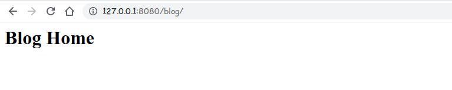
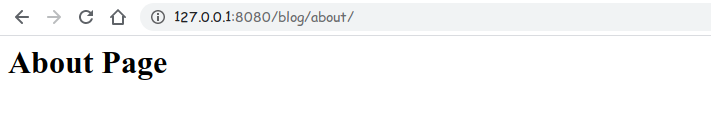

# Django Web Framework

## Part 1 - Getting Started

```zsh
root@admin: ~$ python -m django --version
3.1
root@admin: ~$ django-admin 
Available subcommands:

[django]
    check
    compilemessages
    createcachetable
    dbshell
    diffsettings
    dumpdata
    flush
    inspectdb
    loaddata
    makemessages
    makemigrations
    migrate
    runserver
    sendtestemail
    shell
    showmigrations
    sqlflush
    sqlmigrate
    sqlsequencereset
    squashmigrations
    startapp
    startproject
    test
    testserver
# now using 'startproject' subcommands we create our django project.
# django-admin startproject 'django_project' # 'django_project' is the project name.
root@admin: ~$ django-admin startproject django_project
root@admin: ~$ cd django_project
root@admin: ~$ ls
django_project manage.py
root@admin: ~$ tree
.
├── django_project
│   ├── asgi.py
│   ├── __init__.py
│   ├── settings.py
│   ├── urls.py
│   └── wsgi.py
└── manage.py
```

- The outer `django_project/` root directory is a container for your project. Its name doesn’t matter to Django; you can rename it to anything you like.
- `manage.py`: A command-line utility that lets you interact with this Django project in various ways. You can read all the details about manage.py in django-admin and manage.py.
- The inner `django_project/ directory` is the actual Python package for your project. Its name is the Python package name you’ll need to use to import anything inside it (e.g. django_project.urls).
- `django_project/__init__.py`: An empty file that tells Python that this directory should be considered a Python package. If you’re a Python beginner, read more about packages in the official Python docs.
- `django_project/settings.py`: Settings/configuration for this Django project. Django settings will tell you all about how settings work.
- `django_project/urls.py`: The URL declarations for this Django project; a “table of contents” of your Django-powered site. You can read more about URLs in URL dispatcher.
- `django_project/asgi.py`: An entry-point for ASGI-compatible web servers to serve your project. See How to deploy with ASGI for more details.
- `django_project/wsgi.py`: An entry-point for WSGI-compatible web servers to serve your project. See How to deploy with WSGI for more details.

Now we run our very basic django_project from `terminal`

```console
root@admin: ~$ ls
django_project manage.py
root@admin: ~$ python manage.py runserver
```

**Preview** your basic django website:


## Part 2 - Applications and Routes

First Create our Django `application` using `startapp` subcommands

```console
root@admin: ~$ django-admin startapp blog
root@admin: ~$ tree
.
├── blog
│   ├── admin.py
│   ├── apps.py
│   ├── __init__.py
│   ├── migrations
│   │   └── __init__.py
│   ├── models.py
│   ├── tests.py
│   └── views.py
├── db.sqlite3
├── django_project
│   ├── asgi.py
│   ├── __init__.py
│   ├── settings.py
│   ├── urls.py
│   └── wsgi.py
└── manage.py
```

Now open up my `views.py` file and write some `code` into it.

_blog/views.py_:

```py
from django.shortcuts import render
from django.http import HttpResponse

def home(request):
    return HttpResponse('<h1>Blog Home</h1>')
```

Then create new python file `urls.py` inside `blog` apps.

```console
root@admin: ~$ cd blog
root@admin: ~$ ls
__init__.py  admin.py  apps.py  migrations  models.py  tests.py  views.py
root@admin: ~$ touch urls.py
root@admin: ~$ ls
__init__.py  admin.py  apps.py  migrations  models.py  tests.py  urls.py  views.py
```

_blog/urls.py_:

```py
from django.urls import path
from . import views

urlpatterns = [
    # path(route, view, kwargs=None, name=None)
    path('', views.home, name='blog-home'),
]
```

Now edit our `django_project/urls.py` for `url mapping` with `blog` app `urls.py`

*django_project/urls.py*:

```py
from django.contrib import admin
from django.urls import path
from django.urls import include

urlpatterns = [
    path('admin/', admin.site.urls),
    path('blog/',include('blog.urls'))
]
```

Now open our `terminal` and run our development server.

```console
root@admin: ~$ ls
blog  db.sqlite3  django_project  manage.py
root@admin: ~$ python manage.py runserver
# you can also pass port number with dev-server
root@admin: ~$ python manage.py runserver 8080
Watching for file changes with StatReloader
Performing system checks...

System check identified no issues (0 silenced).

You have 18 unapplied migration(s). Your project may not work properly ......
Run 'python manage.py migrate' to apply them.
December 11, 2020 - 15:17:03
Django version 3.1, using settings 'django_project.settings'
Starting development server at http://127.0.0.1:8080/
Quit the server with CONTROL-C.
```

Open a browser and put this url <http://127.0.0.1:8080/> into the url box and enter.

**main-page**: <http://127.0.0.1:8080/>


**blog-home**: <http://127.0.0.1:8080/blog/>



Add another `view` into the `blog` app.

_blog/views.py_:

```py
from django.http import HttpResponse

# ......

def about(request):
    return HttpResponse('<h1>About Home</h1>')
```

Then, add `routes` for new view.

_blog/urls.py_:

```py
from django.urls import path
from . import views

urlpatterns = [
    # path(route, view, kwargs=None, name=None)
    path('', views.home, name='blog-home'),
    path('about.', views.about, name='blog-about'),
]
```

And then open our `terminal` and run our development server.

```console
root@admin: ~$ python manage.py runserver
# you can also pass port number with dev-server
Watching for file changes with StatReloader
Performing system checks...

System check identified no issues (0 silenced).

You have 18 unapplied migration(s). Your project may not work .........
Run 'python manage.py migrate' to apply them.
December 11, 2020 - 15:17:03
Django version 3.1, using settings 'django_project.settings'
Starting development server at http://127.0.0.1:8000/
Quit the server with CONTROL-C.
```

Open a browser and put this url <http://127.0.0.1:8000/> into the url box and enter.

**blog-home**: <http://127.0.0.1:8000/blog/about/>



Now if we make `change` into our project `urls.py` like below

*django_project/urls.py*:

```py
from django.contrib import admin
from django.urls import path
from django.urls import include

urlpatterns = [
    path('admin/', admin.site.urls),
    path('',include('blog.urls')) # empty route
]
```

Now `empty` route + `empty` route. We made `views.home` is our dev-server homepage.
