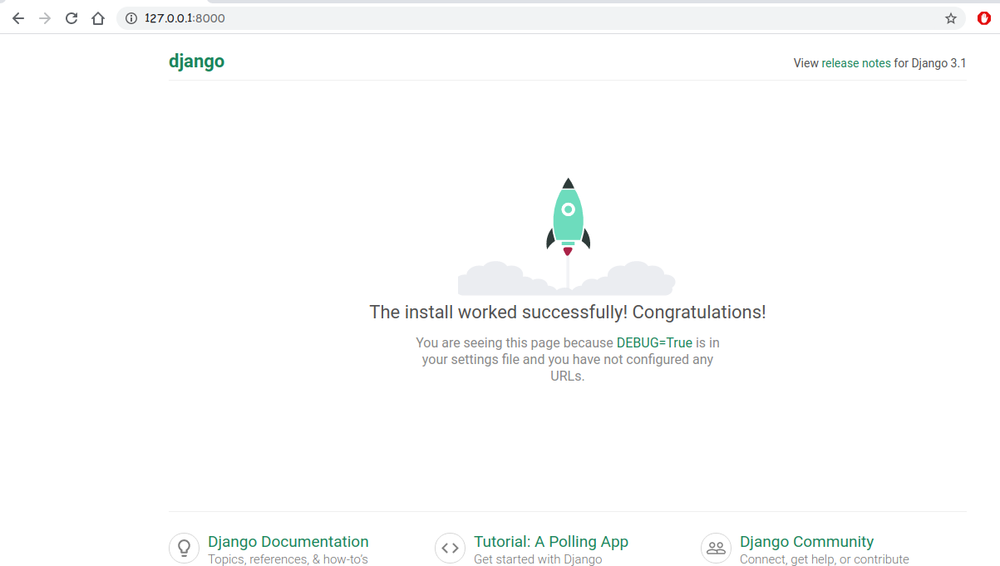

# Django Web Framework

## Part 1 - Getting Started

```zsh
root@admin: ~$ python -m django --version
3.1
root@admin: ~$ django-admin 
Available subcommands:

[django]
    check
    compilemessages
    createcachetable
    dbshell
    diffsettings
    dumpdata
    flush
    inspectdb
    loaddata
    makemessages
    makemigrations
    migrate
    runserver
    sendtestemail
    shell
    showmigrations
    sqlflush
    sqlmigrate
    sqlsequencereset
    squashmigrations
    startapp
    startproject
    test
    testserver
# now using 'startproject' subcommands we create our django project.
# django-admin startproject 'django_project' # 'django_project' is the project name.
root@admin: ~$ django-admin startproject django_project
root@admin: ~$ cd django_project
root@admin: ~$ ls
django_project manage.py
root@admin: ~$ tree
.
├── django_project
│   ├── asgi.py
│   ├── __init__.py
│   ├── settings.py
│   ├── urls.py
│   └── wsgi.py
└── manage.py
```

- The outer `django_project/` root directory is a container for your project. Its name doesn’t matter to Django; you can rename it to anything you like.
- `manage.py`: A command-line utility that lets you interact with this Django project in various ways. You can read all the details about manage.py in django-admin and manage.py.
- The inner `django_project/ directory` is the actual Python package for your project. Its name is the Python package name you’ll need to use to import anything inside it (e.g. django_project.urls).
- `django_project/__init__.py`: An empty file that tells Python that this directory should be considered a Python package. If you’re a Python beginner, read more about packages in the official Python docs.
- `django_project/settings.py`: Settings/configuration for this Django project. Django settings will tell you all about how settings work.
- `django_project/urls.py`: The URL declarations for this Django project; a “table of contents” of your Django-powered site. You can read more about URLs in URL dispatcher.
- `django_project/asgi.py`: An entry-point for ASGI-compatible web servers to serve your project. See How to deploy with ASGI for more details.
- `django_project/wsgi.py`: An entry-point for WSGI-compatible web servers to serve your project. See How to deploy with WSGI for more details.

Now we run our very basic django_project from `terminal`

```console
root@admin: ~$ ls
django_project manage.py
root@admin: ~$ python manage.py runserver
```

**Preview** your basic django website:


