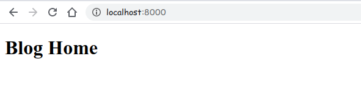
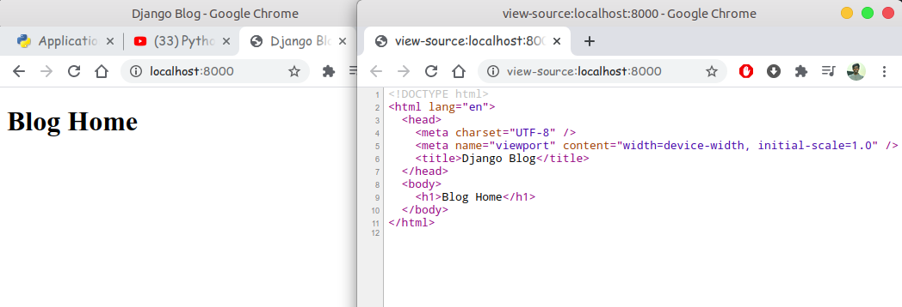
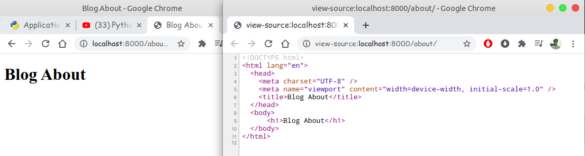
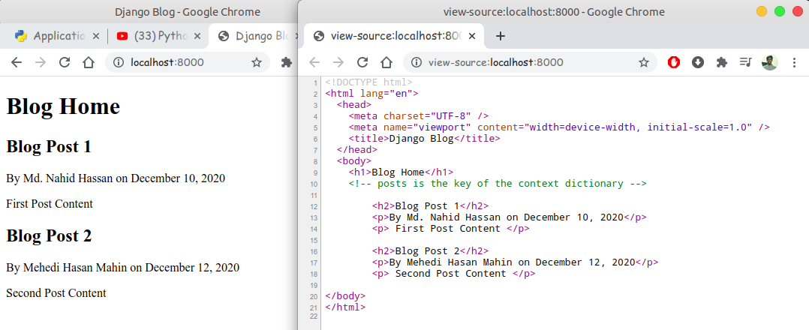
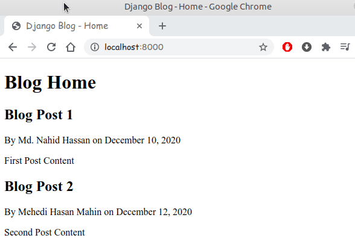

# Django Web Framework

- [Django Web Framework](#django-web-framework)
  - [Part 1 - Getting Started](#part-1---getting-started)
  - [Part 2 - Applications and Routes](#part-2---applications-and-routes)
  - [Part 3 - Templates](#part-3---templates)

## Part 1 - Getting Started

```zsh
root@admin: ~$ python -m django --version
3.1
root@admin: ~$ django-admin 
Available subcommands:

[django]
    check
    compilemessages
    createcachetable
    dbshell
    diffsettings
    dumpdata
    flush
    inspectdb
    loaddata
    makemessages
    makemigrations
    migrate
    runserver
    sendtestemail
    shell
    showmigrations
    sqlflush
    sqlmigrate
    sqlsequencereset
    squashmigrations
    startapp
    startproject
    test
    testserver
# now using 'startproject' subcommands we create our django project.
# django-admin startproject 'django_project' # 'django_project' is the project name.
root@admin: ~$ django-admin startproject django_project
root@admin: ~$ cd django_project
root@admin: ~$ ls
django_project manage.py
root@admin: ~$ tree
.
├── django_project
│   ├── asgi.py
│   ├── __init__.py
│   ├── settings.py
│   ├── urls.py
│   └── wsgi.py
└── manage.py
```

- The outer `django_project/` root directory is a container for your project. Its name doesn’t matter to Django; you can rename it to anything you like.
- `manage.py`: A command-line utility that lets you interact with this Django project in various ways. You can read all the details about manage.py in django-admin and manage.py.
- The inner `django_project/ directory` is the actual Python package for your project. Its name is the Python package name you’ll need to use to import anything inside it (e.g. django_project.urls).
- `django_project/__init__.py`: An empty file that tells Python that this directory should be considered a Python package. If you’re a Python beginner, read more about packages in the official Python docs.
- `django_project/settings.py`: Settings/configuration for this Django project. Django settings will tell you all about how settings work.
- `django_project/urls.py`: The URL declarations for this Django project; a “table of contents” of your Django-powered site. You can read more about URLs in URL dispatcher.
- `django_project/asgi.py`: An entry-point for ASGI-compatible web servers to serve your project. See How to deploy with ASGI for more details.
- `django_project/wsgi.py`: An entry-point for WSGI-compatible web servers to serve your project. See How to deploy with WSGI for more details.

Now we run our very basic django_project from `terminal`

```console
root@admin: ~$ ls
django_project manage.py
root@admin: ~$ python manage.py runserver
```

**Preview** your basic django website:


## Part 2 - Applications and Routes

First Create our Django `application` using `startapp` subcommands

```console
root@admin: ~$ django-admin startapp blog
root@admin: ~$ tree
.
├── blog
│   ├── admin.py
│   ├── apps.py
│   ├── __init__.py
│   ├── migrations
│   │   └── __init__.py
│   ├── models.py
│   ├── tests.py
│   └── views.py
├── db.sqlite3
├── django_project
│   ├── asgi.py
│   ├── __init__.py
│   ├── settings.py
│   ├── urls.py
│   └── wsgi.py
└── manage.py
```

Now open up my `views.py` file and write some `code` into it.

_blog/views.py_:

```py
from django.shortcuts import render
from django.http import HttpResponse

def home(request):
    return HttpResponse('<h1>Blog Home</h1>')
```

Then create new python file `urls.py` inside `blog` apps.

```console
root@admin: ~$ cd blog
root@admin: ~$ ls
__init__.py  admin.py  apps.py  migrations  models.py  tests.py  views.py
root@admin: ~$ touch urls.py
root@admin: ~$ ls
__init__.py  admin.py  apps.py  migrations  models.py  tests.py  urls.py  views.py
```

_blog/urls.py_:

```py
from django.urls import path
from . import views

urlpatterns = [
    # path(route, view, kwargs=None, name=None)
    path('', views.home, name='blog-home'),
]
```

Now edit our `django_project/urls.py` for `url mapping` with `blog` app `urls.py`

*django_project/urls.py*:

```py
from django.contrib import admin
from django.urls import path
from django.urls import include

urlpatterns = [
    path('admin/', admin.site.urls),
    path('blog/',include('blog.urls'))
]
```

Now open our `terminal` and run our development server.

```console
root@admin: ~$ ls
blog  db.sqlite3  django_project  manage.py
root@admin: ~$ python manage.py runserver
# you can also pass port number with dev-server
root@admin: ~$ python manage.py runserver 8080
Watching for file changes with StatReloader
Performing system checks...

System check identified no issues (0 silenced).

You have 18 unapplied migration(s). Your project may not work properly ......
Run 'python manage.py migrate' to apply them.
December 11, 2020 - 15:17:03
Django version 3.1, using settings 'django_project.settings'
Starting development server at http://127.0.0.1:8080/
Quit the server with CONTROL-C.
```

Open a browser and put this url <http://127.0.0.1:8080/> into the url box and enter.

**main-page**: <http://127.0.0.1:8080/>


**blog-home**: <http://127.0.0.1:8080/blog/>


Add another `view` into the `blog` app.

_blog/views.py_:

```py
from django.http import HttpResponse

# ......

def about(request):
    return HttpResponse('<h1>About Home</h1>')
```

Then, add `routes` for new view.

_blog/urls.py_:

```py
from django.urls import path
from . import views

urlpatterns = [
    # path(route, view, kwargs=None, name=None)
    path('', views.home, name='blog-home'),
    path('about.', views.about, name='blog-about'),
]
```

And then open our `terminal` and run our development server.

```console
root@admin: ~$ python manage.py runserver
# you can also pass port number with dev-server
Watching for file changes with StatReloader
Performing system checks...

System check identified no issues (0 silenced).

You have 18 unapplied migration(s). Your project may not work .........
Run 'python manage.py migrate' to apply them.
December 11, 2020 - 15:17:03
Django version 3.1, using settings 'django_project.settings'
Starting development server at http://127.0.0.1:8000/
Quit the server with CONTROL-C.
```

Open a browser and put this url <http://127.0.0.1:8000/> into the url box and enter.

**blog-home**: <http://127.0.0.1:8000/blog/about/>


Now if we make `change` into our project `urls.py` like below

*django_project/urls.py*:

```py
from django.contrib import admin
from django.urls import path
from django.urls import include

urlpatterns = [
    path('admin/', admin.site.urls),
    path('',include('blog.urls')) # empty route
]
```

Now `empty` route + `empty` route. We made `views.home` is our dev-server homepage.

## Part 3 - Templates

For use templates we are going to create a new folder within the blog app directory create a directory calls `templates`. By default django looks for a templates subdirectory and each of our installed apps. Inside `templates` directory we create a subdirectory called `blog`. Same as apps name.(_This is a django convention_).

```console
root@admin: ~$ pwd
../django_project/blog/
root@admin: ~$ mkdir templates
root@admin: ~$ cd templates
root@admin: ~$ mkdir blog
root@admin: ~$ cd blog
root@admin: ~$ touch about.html home.html # for our two views
root@admin: ~$ cd ./../../
root@admin: ~$ pwd
../django_project/blog/
root@admin: ~$ tree
/templates/
└── blog
    ├── about.html
    └── home.html
```

Here we create two html files(`about.html`, `home.html`) inside `blog` apps. Now edit it.

_blog/templates/blog/home.html_:

```html
<!DOCTYPE html>
<html lang="en">
  <head>
    <meta charset="UTF-8" />
    <meta name="viewport" content="width=device-width, initial-scale=1.0" />
    <title>Django Blog</title>
  </head>
  <body>
    <h1>Blog Home</h1>
  </body>
</html>
```

Now we have our templates ready. we have to add our blog application to our list of installed apps. So that Django knows to look  there for a templates directory. To doing that, open `settings.py` file in project_directory and put the app name into the `INSTALLED_APPS` list.

_django_project/settings.py_:

```py
....
INSTALLED_APPS = [
    'blog.apps.BlogConfig',
    'django.contrib.admin',
    'django.contrib.auth',
    'django.contrib.contenttypes',
    'django.contrib.sessions',
    'django.contrib.messages',
    'django.contrib.staticfiles',
]
....
# 'blog.apps.BlogConfig' is the path of our blog apps app configuration.
"""
blog/
    apps.py
        from django.apps import AppConfig
        class BlogConfig(AppConfig):
            name = 'blog'

"""
```

Now lets use the `templates` that we created so that it renders that whenever we navigate to our home page so in order to do that we have to point our blog `views` to use those templates. So now open up our blog views and and loading and render our templates. There are several way to do that. Here we use `django.shortcut -> render` method

_blog/views.py_:

```py
# first import render method from django.shortcuts
from django.shortcuts import render

# Now we return an rendered template instead of our HttpResponse
def home(request):
    """
        render(request, template_name(str), context=dict())
        
        request: first_arguments
        template_name: 'app_name/template_name_that_we_render'            # here app name is blog
        context: passing information into our template using dictionary.  # context is optional
    """
    return render(request, 'blog/home.html') # still return an HttpResponse in the background.
```

**Note**: `views` always return a `HttpResponse` or an `Exception`.

Now check all that's works. Open the terminal and run,

```console
root@admin: ~$ ls
blog  db.sqlite3  django_project  manage.py
root@admin: ~$ python manage.py runserver 8000
Watching for file changes with StatReloader
Performing system checks...

System check identified no issues (0 silenced).

You have 18 unapplied migration(s). Your project may not work properly....
Run 'python manage.py migrate' to apply them.
December 12, 2020 - 12:58:52
Django version 3.1, using settings 'django_project.settings'
Starting development server at http://127.0.0.1:8000/
Quit the server with CONTROL-C.
```

Open a browser and put this url <http://127.0.0.1:8000/> into the url box and enter.



Great all works. But we see the same result that we seen before. Wait...`view the page source`. Ooh! Here is the source code that we write our `home.html` files.



Now edit our second views template files `about.html`.

_blog/about.html_:

```html
<!DOCTYPE html>
<html lang="en">
  <head>
    <meta charset="UTF-8" />
    <meta name="viewport" content="width=device-width, initial-scale=1.0" />
    <title>Blog About</title>
  </head>
  <body>
      <h1>Blog About</h1>
  </body>
</html>
```

Next render `about.html` from our `views.py` file.

_blog/views.py_:

```py
def about(request):
    return render(request, 'blog/about.html')
```



Now work with third and optional `parameter` in `render()` method. Create some fake post for  passing into our templates.

```py
# create list of post and each dictionary will be information associated with one post
posts = [
    {
        'author': 'Md. Nahid Hassan',
        'title': 'Blog Post 1',
        'content': 'First Post Content',
        'date_posted': 'December 10, 2020'
    },
    {
        'author': 'Mehedi Hasan Mahin',
        'title': 'Blog Post 2',
        'content': 'Second Post Content',
        'date_posted': 'December 12, 2020'
    }
]
```

So lets pretend for now that we made a `database call` and get back a `list of post` and we want to display these post on our blog `home` page. So, we can pass these post into our `template` just by passing an `argument` with our data and we will put our data into a `dictionary`. So within our `home` view

_blog/views.py_:

```py
def home(request):
    context = {
        # key is post and value is our list of posts
        # pass context=context as third argument and 
        # then we are access it using key_name into the template 
        'posts': posts
    }
    return render(request, 'blog/home.html', context=context)
```

Now let's switch over to our `home.html` template so we can see how to use this...
Here we use `django_template_engine` that allows us to write code here within our templates so to write a for loop. we can open codeblock...

**Loop template example**:

**Demo**:

```html
<!-- Demo for loop-->

<!-- write some code -->


<!-- Demo for if condition-->

<!-- write some code -->


<!-- Demo for access a variable -->
{{ variable }}
```

Now our `home.html` template,

```html
<h1>Blog Home</h1>
<!-- posts is the key of the context dictionary -->

    <h2>{{ post.title }}</h2>
    <p>By {{ post.author }} on {{  post.date_posted }}</p>
    <p> {{ post.content }} </p>

```

Now check all that's works. Open the terminal and run,

```console
root@admin: ~$ ls
blog  db.sqlite3  django_project  manage.py
root@admin: ~$ python manage.py runserver 8000
Watching for file changes with StatReloader
Performing system checks...

System check identified no issues (0 silenced).

You have 18 unapplied migration(s). Your project may not work properly....
Run 'python manage.py migrate' to apply them.
December 12, 2020 - 12:58:52
Django version 3.1, using settings 'django_project.settings'
Starting development server at http://127.0.0.1:8000/
Quit the server with CONTROL-C.
```

Open a browser and put this url <http://127.0.0.1:8000/> into the url box and enter.



Now use `if` into our home.html `title` tag. Here if we pass a title then this title is shows as our page title if not pass any title then we just use a default of `Django blog` or something like that. Now make this changes into our templates

In _blog/views.py_:

```py
def home(request):
    context = {
        'posts': posts,
        'title': 'Home',
    }
    return render(request, 'blog/home.html', context=context)
```

In _blog/home.html_:

```html

    <title>Django Blog - {{ title }}</title>

    <title>Django Blog</title>

```

In _blog/views.py_:

```py
def about(request):
    # Here {'title':'About'} pass for context parameter
    return render(request, 'blog/about.html', {'title':'About'})
```

In _blog/about.html_:

```html

    <title>Django Blog - {{ title }}</title>

    <title>Django Blog</title>

```

**See the effect**:



So, we are almost finished up with this tutorial but there is one thing about our templates that isn't very good design right now. So if you notice our home page template and our about page template have a lot of similar `repeated code`  and that is never good in programming because it means if we want to update one of those sections then we would need to update it in every location so for example if we wanted to change our default title for our website then we would have to make that change in both home and about templates and the more pages that we have with repeated code the `worse` that problem would be so it would be better to have everything that is repeated in a `single place` so that there is  only one page to make changes and our home template and about template only contains the information that is `unique` to those both pages. So to accomplishes this we can  use something called `inheritance`. so let's see what it's look like...

So, let's create new template into our `template/blog/` directory name `base.html`.

```console
root@admin: ~$ touch base.html
```

And into the `base.html` template we put that all the `repeated sections` between our `home` and our `about` template.

_blog/base.html_:

```html
<!DOCTYPE html>
<html lang="en">

<head>
    <meta charset="UTF-8" />
    <meta name="viewport" content="width=device-width, initial-scale=1.0" />
    
    <title>Django Blog - {{ title }}</title>
    
    <title>Django Blog</title>
    
</head>

<body>
    
        <!-- write you code here..... -->
    
</body>

</html>
```

> Block Is A Section That Child Templates Can Override

Now in our child templates, first we need to extend `parent` or `base` template then open the `block content`.

_blog/home.html_:

```html


<!-- block content start point -->

    <h1>Blog Home</h1>
    <!-- posts is the key of the context dictionary -->
    
    <h2>{{ post.title }}</h2>
    <p>By {{ post.author }} on {{ post.date_posted }}</p>
    <p>{{ post.content }}</p>
    

<!-- block contend end point -->

```

_blog/about.html_:

```html


<!-- block content start point -->


<h1>Blog About</h1>

<!-- block content end point -->

```

> Note: we can add and create multiple block content and add multiple base/parent template into the child template.

So now we have less code in both `home` and `about` templates and everything is work like same before we already seen.

Now add bootstrap into our template for make our blog page more responsive and beautiful.

`Bootstrap starter Template`: <https://getbootstrap.com/docs/4.3/getting-started/introduction/#starter-template>

After adding `bootstrap` into our `base.html` template...

```html
<!DOCTYPE html>
<html lang="en">

<head>
    <!-- Required meta tags -->
    <meta charset="utf-8">
    <meta name="viewport" content="width=device-width, initial-scale=1, shrink-to-fit=no">

    <!-- Bootstrap CSS -->
    <link rel="stylesheet" href="https://stackpath.bootstrapcdn.com/bootstrap/4.3.1/css/bootstrap.min.css"
        integrity="sha384-ggOyR0iXCbMQv3Xipma34MD+dH/1fQ784/j6cY/iJTQUOhcWr7x9JvoRxT2MZw1T" crossorigin="anonymous">

    
    <title>Django Blog - {{ title }}</title>
    
    <title>Django Blog</title>
    
</head>

<body>
    <div class="container">
        
        <!-- write you code here..... -->
        
    </div>
    <!-- Optional JavaScript -->
    <!-- jQuery first, then Popper.js, then Bootstrap JS -->
    <script src="https://code.jquery.com/jquery-3.3.1.slim.min.js"
        integrity="sha384-q8i/X+965DzO0rT7abK41JStQIAqVgRVzpbzo5smXKp4YfRvH+8abtTE1Pi6jizo"
        crossorigin="anonymous"></script>
    <script src="https://cdnjs.cloudflare.com/ajax/libs/popper.js/1.14.7/umd/popper.min.js"
        integrity="sha384-UO2eT0CpHqdSJQ6hJty5KVphtPhzWj9WO1clHTMGa3JDZwrnQq4sF86dIHNDz0W1"
        crossorigin="anonymous"></script>
    <script src="https://stackpath.bootstrapcdn.com/bootstrap/4.3.1/js/bootstrap.min.js"
        integrity="sha384-JjSmVgyd0p3pXB1rRibZUAYoIIy6OrQ6VrjIEaFf/nJGzIxFDsf4x0xIM+B07jRM"
        crossorigin="anonymous"></script>
</body>
</body>

</html>
```


