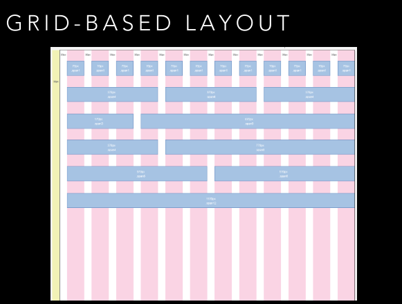
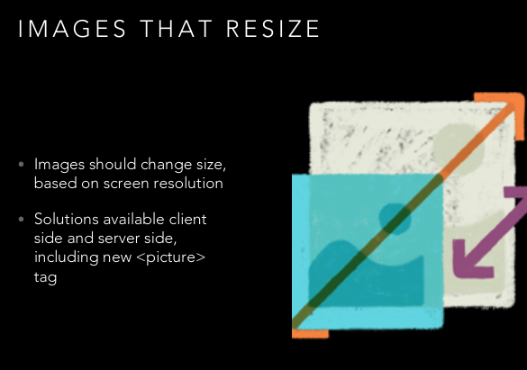
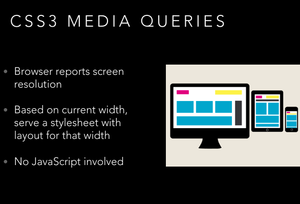

# CSS Grids and Flexbox for Responsive Web Design

[Course Resources](https://github.com/jen4web/fem-layout.git)

## Table of Contents

- [CSS Grids and Flexbox for Responsive Web Design](#css-grids-and-flexbox-for-responsive-web-design)
  - [Table of Contents](#table-of-contents)
    - [Introduction to Setup](#introduction-to-setup)
      - [Resources](#resources)
      - [Defining Responsive Design](#defining-responsive-design)
    - [Floats](#floats)
      - [Overview of Floats](#overview-of-floats)

### Introduction to Setup

#### Resources

[Course Resources](https://github.com/jen4web/fem-layout.git)

#### Defining Responsive Design

Defined by three characteristics

- **Flexible grid-based layout**
  
- **Media Queries(CSS3)**
  
- **Images that resizes**
  

### Floats

#### Overview of Floats