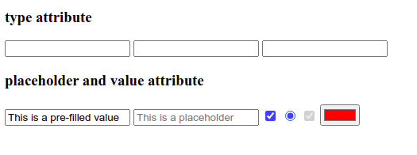
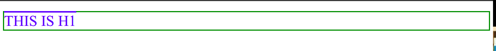
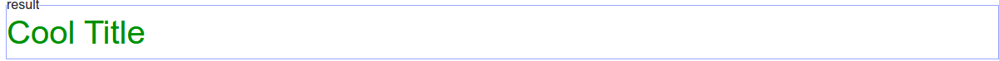
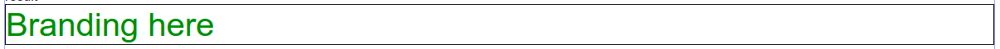
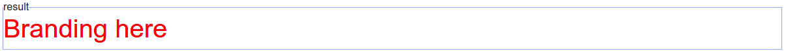

# Complete Intro to Web Development, v2

## Table of Contents

- [Complete Intro to Web Development, v2](#complete-intro-to-web-development-v2)
  - [Table of Contents](#table-of-contents)
    - [Web Development Tools](#web-development-tools)
      - [Tools:](#tools)
      - [Trusted Resources:](#trusted-resources)
    - [Learning HTML](#learning-html)
      - [Basic HTML](#basic-html)
      - [HTML Elements](#html-elements)
      - [HTML Comments](#html-comments)
      - [HTML Attributes](#html-attributes)
      - [HTML Classes](#html-classes)
      - [HTML ID](#html-id)
      - [Meta HTML](#meta-html)
    - [Learning CSS](#learning-css)
      - [Basic CSS](#basic-css)
      - [CSS Rules](#css-rules)
      - [Parents and Children](#parents-and-children)
      - [CSS Selectors and the Cascade](#css-selectors-and-the-cascade)
      - [IDs and !important](#ids-and-important)
      - [Pseudoclasses](#pseudoclasses)
      - [CSS Specificity](#css-specificity)
      - [CSS Box Model](#css-box-model)
      - [CSS Floats and Flexbox](#css-floats-and-flexbox)

### Web Development Tools

#### Tools:

- **Browser**: Firefox, \*Chrome, Safari.
- **Editor**: \*Visual Studio Code, Sublime Text 3, Atom, WebStorm, Vim, Emacs.
- **Terminal**: iTerm2, Hyper, fish, zsh.

**Note**: `iTerm2/Hyper/fish/zsh` is an emulator and `bash` is the `shell`.

#### Trusted Resources:

- **\*MDN**(Mozilla Developer Network)
- W3Schools
- **\*CSS-Tricks**
- Documentation

### Learning HTML

#### Basic HTML

[Basic HTML Documentation](https://btholt.github.io/intro-to-web-dev-v2/basic-html)

**Heading**:

```html
<!-- start -->
<h1>Heading 1</h1>
<h2>Heading 2</h2>
<h3>Heading 3</h3>
<!-- ........ -->
<h6>Heading 6</h6>
```

**Correct**:

```html
<div>
  <h1>Hi</h1>
</div>
```

**Incorrect**:

```html
<div>
    <h1>
     Hi
    </div>
</h1>
```

The above is incorrect. I can't close the div before I close the `h1` since the `h1` was the last one I opened.

```html
<!-- Self closing tag or void tag -->
<!-- <input/> tag  take inputs from the user-->
<input />
```

#### HTML Elements

Let's explore some of the essential tag types.

- `<h1>`, `<h2>`, `<h3>`, `<h4>`, `<h5>`, and `<h6>` - Heading. These are the six levels of headings and subheadings you can have. You can see up top of this page we have `HTML` which is an `h1` and then below that we have `Types of Tags` which is an `h2`. An `h2` is a subheading to an `h1` and an `h3` is a subheading to a `h2`. Each page should only have one `h1` tag.

```html
<!-- Heading Tag -->
<!-- most important one -->
<h1>Heading 1</h1>
<!-- 2nd most important and subheading on heading 1-->
<h2>Heading 2</h2>
<!-- 3rd most important and subheading on heading 2-->
<h3>Heading 3</h3>
<h4>Heading 4</h4>
<h5>Heading 5</h5>
<h6>Heading 6</h6>
```

- `P` - Paragraph. You'll put a paragraph of text together inside of a `p` tag. Only text goes in `p` tags. Each one of these paragraphs is a `p` tag.

```html
<p>A paragraph of text</p>
```

- `a` - Anchor. An `a` tag is a link to somewhere else. Every `a` tag needs a destination of where the link should take you.

```html
<!-- Anchor Tag -->
<a href="www.google.com">google</a>
<a href="/file_location">File Location</a>
```

- `div` – Short for division. A div is sort of like a cardboard box. It's not really anything by itself; it's more defined by what's in it. It's a generic container tag for grouping together other things. You'll use a lot of `divs`. Very useful with CSS. In general, you want to group together "like" things into a containing tag (like a div) to keep them together. If you have a website with a list of blog posts that each have paragraphs, titles, images, etc. you'll group each post together in a div or other container-type tag typically.

- `span` – A container for small pieces of text. If a div is like a cardboard box, a span is like a Ziploc bag. It doesn't change the styling of anything by itself but it allows you use CSS and JavaScript later to make that text different in some way. Example: `<p>Here is some text. <span>This text is in a span</span> but it doesn't look any different.</p>`

- `ol, ul, and li` – Both ol and ul represent lists. In fact, this list of various tags is a ul! A ul is an unordered list: it's a list of things that could be shuffled and still mean the same thing. If I asked you to list all the teams in a sports league, or all the characters on a TV show, those could be presented in any order. An ol is an organized list: what comes first matters. If I ask you to list out the ten most populous cities in the world, there is an order to that and changing the order makes the list incorrect. In either list, each item in the list is an li. Example: `<ul><li>Bob</li><li>Eve</li><li>Alice</li></ul>`

- `button` – A … button. A button can be used by JavaScript to respond to a user clicking it, or it can be used by a form to signal a user has completed filling it and it should submit the data. Think of it like a doorbell to your house: you can put the doorbell button there but it's not going to do much unless you connect it to the buzzer. Example: `<button>Click me!!</button>`

- `img` – An image. You use this to load images onto the page. This can be confusing because you can use CSS to bring in images too. The key difference is that when the image is apart of the content, like a diagram that shows data you're talking about or a picture that shows something from the article, it should be an img tag. If it's a nice background image or something that's for decoration of your website, use CSS. An img tag needs a src to say where the image is coming from and alt to say what is in the image for screen readers so that the image will still be useful to blind people, people who are hard of seeing, and Google and Bing search engines. img are always self-closing tags. Example: ``
- `input` – Browser inputs. Sometimes you need to gather input from the user. Luckily for us, the browser is already really good at doing that. It gives us several types of inputs that you can use. You can also have these input tags do numbers, dates, colors, checkboxes, radio buttons, and others. We'll explore them more later when we talk about forms. Inputs are always self-closing tags. Example: `<input />`.

- `textarea` – Similar to an input but for a lot more text. You'd type long-form responses in here that could linebreaks in it (a linebreak happens when you hit "return" or "enter" on your keyboard.) Despite never having anything inside of a textarea, it is not a self-closing tag. HTML is a really old language and so we have to live with some old quirks. Example: `<textarea></textarea>`

- select and option — Sometimes you want to limit a user to a certain group of options to select from. What country you're from, what month you were born in, etc. A select is a user-interactive input that a user can select an option from a dropdown menu. An option is one of the available options. Each option needs a value that will be sent back to the server if the user select that option. What's inside of the option is what shown to the user. Example: `<select><option value="seattle">Seattle</option><option value="portland">Portland</option><option value="san-francisco">San Francisco</option></select>`

- `form `– A group of html tags related to gathering data from a user. This will be some combination of input, textarea, and select tags. You can then use this form element to send that data to your server. A form tag itself doesn't show anything; it's a just a container for the other tags. We'll use them more later. For now, just know they exist. Example: `<form><input /><textarea></textarea></form>`

- `table, tr, and td` – Like making a table in Word or Excel. If you have a table of data, this is the best way to display it. Just for your context, we used to do terrible, awful things with tables to make websites, way back when. Because of that, some tutorial will tell you never ever use tables. That's not good either because when you have tabular data (something you would put into Excel) then tables are very useful. The table is the container for the whole table, tr represents a row, and td represents one cell in the table. Example: ` `<table><tr><td>(0,0)</td><td>(1,0)</td></tr><tr><td>(0,1)</td><td>(1,1)</td></tr></table>`

There are many, many, many more tags. This is just a highlight of some of the more useful, common ones.

#### HTML Comments

We, as coders, forget what things do. We write things that are really complicated or we know will be difficult to figure out later. Something to keep in mind is that you are mostly writing code for yourself to read later, not for the computer. The hardest part of writing code is having to maintain it later, not writing it the first time. Writing code the first time is the easier part. Going back and trying to remember what the hell you were thinking is the hard part.

This is where **comments** can be useful. You can leave little notes in your code that the computer won't read, it'll just ignore them. In HTML, the way you write a comment is `<!-- your comments go here -->`.

#### HTML Attributes

Let's start with a text **input** tag. There are several types of inputs that we discussed in the previous section: `text`, `color`, `checkboxes`, `radio buttons`, etc. How can the browser tell which is meant to be what? HTML **attributes**! Attributes are additional pieces of information that you can attach to HTML tags. We're going to use the type attribute to pass that to the browser.

`type` is considered an **attribute**. Different tags have different **attributes** that they care about. For example, the type attribute is not useful with `p`, `div`, `h1`, etc. You can still put a type attribute on these tags; they'll just **ignore** them.

```html
<!-- type attribute -->
<h3>type attribute</h3>
<input type="text" />
<input type="email" />
<input type="number" />

<h3>placeholder and value attribute</h3>

<input value="This is a pre-filled value" />
<input placeholder="This is a placeholder" />
<input type="checkbox" checked />
<input type="radio" checked />
<input type="checkbox" disabled checked />
<input type="color" value="#FF0000" />
```



**Note**: `inputs` aren't the only ones to use **attributes**. In fact they are used everywhere in HTML. This is just to demonstrate to you what they look like and how certain attributes do certain things. If something isn't working for you, always check to see if you misspelled one of the tag names or attributes; that's an easy thing to mess up and hard to tell it happened.

#### HTML Classes

**Classes** are special attributes that can go on `any tag`, though some you won't use it with. While a class does nothing itself, it allows that tag to be found by your **CSS** and your **JavaScript**. Using our house analogy, you don't want to make a rule that says "all walls are south facing." It's nonsensical and you could never build a house that way. Instead, you'd make a rule that says "walls marked south-facing
-wall are south facing." This is what classes allow you to do: they allow you to mark your HTML so you can write rules and code to govern them later. Let's see what that looks like.

```html
<div class="header">
  <h1 class="header-title">My Great Blog</h1>
</div>
<div class="blog-posts">
  <div class="post">
    <h1 class="post-title">When Not to Overextend House Metaphors</h1>
    <p class="post-text">…</p>
  </div>
  <div class="post">
    <h1 class="post-title">Another Great Blog Post</h1>
    <p class="post-text">…</p>
  </div>
</div>
```

#### HTML ID

**IDs** are far less useful than classes. Whereas you'll be using classes everywhere and frequently, you should be using IDs very sparingly. As you see in our above blog-posts HTML, we can `re-use classes` like post and post-title. This is extremely important. As a coder, you want a piece of code and use it a lot. As coders, we want to write as little code as possible (which we'll explore why later, for now trust me.) For now, be satisfied that I get to write a little bit of code that governs post and have it affect every post on the page.

Let's contrast that with IDs. `When you designate something with an ID, you're affirming that this is the only one of those on your website. Not even just that page, but your whole website`. Sometimes that is useful; just not very often. Some other coders and tutorials will tell you to never use IDs; I think that's misguided. IDs are a sledgehammer. Most problems don't require a sledgehammer. However sometimes you have problems that need a sledgehammer and then you're really grateful that you have one.

Let's see what an ID would look like:

```html
<div class="header">
  <h1 class="header-title">My Great Blog</h1>
</div>
<div class="blog-posts">
  <div id="house-metaphors-post" class="post">
    <h1 class="post-title">When Not to Overextend House Metaphors</h1>
    <p class="post-text">…</p>
  </div>
  <div class="post">
    <h1 class="post-title">Another Great Blog Post</h1>
    <p class="post-text">…</p>
  </div>
</div>
```

**Note**: Another reason that is very useful about IDs is that I now can make a **link** that takes you directly to that ID in the page. Try clicking this link (it won't leave this page.)

**The link should bring you here.**:

This is done using just an ID. The code for that link is:

```html
<a href="#the-h1-part-way-down-the-page">link</a>.
```

That `#` means go to that `ID` on the page.

#### Meta HTML

So far we've just shown you HTML that produces something concrete, something visual. We now need to talk about HTML that you still need but it won't produce visual things.

Let's start with the absolute basic foundations for an HTML page. Like a house needs a foundation, your HTML document needs a basic framework to get up and going.

```html
<!DOCTYPE html>
<html lang="en">
  <head>
    <title>My amazing HTML Document</title>
  </head>
  <body>
    <h1>Check this out</h1>
    <!-- Your amazing HTML here -->
  </body>
</html>
```

### Learning CSS

#### Basic CSS

Okay, now we've began putting HTML elements on a page. Using our house-building analogy, this is like we have all the materials now in a pile in front of our house. However a pile of lumber does not make a house. We're going to start reasoning about how to put together these things, how to create our blueprints, our plans. CSS is really powerful and can accomplish a wide variety of things: **colors**, **sizes**, **order**, **positioning**, **hiding**, **showing**, **animation**, etc. We'll scratch the surface here, but know you can do a lot with just CSS. It's a deep subject and a powerful tool.

Like HTML, CSS is not a programming language. It's a **list of rules** that you give the browser. You'll provide rules to the browser like "all h1s will be colored red." We'll explore why this is different than **JavaScript** later, but know that's the gist.

#### CSS Rules

```css
/* Selector {
    property : value;
} */

h1 {
  color: red;
}
```

That's it! There's your first CSS. Let's dissect each piece of this rule:

- **h1** — This is what we'd call the **selector**. Anything that matches this selector is going to have everything inside the `{ }` applied to it. These selectors can be a wide variety of things but for now we're just selecting every h1 on the page. That's important to keep in mind too: it'll apply the changes to everything that matches that selector.

- **color**: – This is called the **property**. There are about `~350 properties` that you can use but to be honest you'll never use all of them. Maybe fifty to a hundred are used frequently and the rest are a long tail that are rarely used. The color property affects the color of the font (as well as some other things, but for now just assume it means font color.)

- **red** – This is the **value**. This identifies what the value of the property is going to be. In this case, we're telling the color to be red. There are variety of ways to define color in CSS. This is called using "named color", of which there are about 150 different colors that CSS understands. CSS also understands hex values like #**ff0000**, rgb values like **rgb(255, 0, 0)**, and hsl values like **hsl(0, 100%, 50%)**. All those values I gave in the previous sentence are the same color as red. You don't actually need to understand how these values work to understand web programming or CSS and I would assert most web developers don't. If you need to understand, here's a great article on it from **CSS Tricks**.
- **;** – **Every property-value pair will end in a semicolon**. Think of it like a period/full-stop to end of a sentence. This is how the computer knows you're done with that property and moving on.

So let's go a step further. Let's make our h1 even more different! Let's make it **limegreen**, **bigger**, not **bold** (h1s are by-default bold), **underlined**, **uppercased**, and have pink border!

```css
<body>
    <style>
        h1 {
            color:blue;
            font-size: 40px;
            font-weight: normal;
            text-decoration: overline;
            text-transform: uppercase;
            border: 3px solid green;
        }
    </style>
    <h1>
        This is h1
    </h1>
</body>
```



#### Parents and Children

You'll notice that if I have HTML like this:

```html
<div>
  <h1>An h1</h1>
</div>
```

And I have CSS that looks like this:

```css
div {
  color: blue;
}
```

The `h1` will be colored **blue**. This is because it has a **parent** (or **ancestor**) tag that is a div which means that CSS will still affect it. This even works will large degrees of separation.
If I have `<body><div><div><div><div><div><h1>my h1</h1></div></div></div></div></div></body>` and my CSS selector is `body { color: orange }` that will affect the `h1` in the middle.

---

`Please see ./scripts-and-codes/html_css_interaction_1.html and css` code.

#### CSS Selectors and the Cascade

- In this one, we have two rules with the same class (which is "legal" CSS.) So which one gets applied? Since they're equal, the one that comes last wins.

```html
<style>
  .title {
    color: red;
  }

  .title {
    color: green; /*applied*/
  }
</style>
<h1 class="title">Cool Title</h1>
```



- First of all, yes, one tag can have multiple classes, and that can be useful. Okay, so what is this going to look like? In the eyes of CSS, those two selectors are equal since they both have the same specificity (key word, you'll see it used a lot when talking about CSS.) They both specific one class which makes them equal. So in this case, since .title comes last in the CSS, it wins. The color will be green. What about the border? Since .title doesn't conflict, it'll have a black border too. So keep in mind that each of these "conflicts" is resolved on a property-by-property basis. So the end result in an h1 that has a black border and green font.

```html
<style>
  .main-brand-2 {
    border: 1px solid black; /*applied*/
    color: red;
  }

  .title-2 {
    color: green; /*applied*/
  }
</style>
<h1 class="title-2 main-brand-2">Branding here</h1>
```



- This how you add two classes to one selector. Notice there's no space between the two class names (that means something else.) The selector .main-brand.title will only match a tag that has both classes. If has only one of the two, it will not match. As you may imagine, since it has two classes, it's more specific, and therefore it wins.

```html
<style>
  /* if you put any space between 3.title you just break the specificity or more specific*/
  .main-brand-3.title-3 {
    color: red; /*applied*/
  }

  .title-3 {
    color: green;
  }
</style>
<h1 class="title-3 main-brand-3">Branding here</h1>
```



- **Classes are more specific than tags**.

```text
1 class = 10 points
1 tag = 1 points

## Some Calculations
-------------------------------------------------------
h1.main-brand-5         = 1 + 10     = 11 points
.main-brand-5.title-5   = 10 + 10    = 20 points # wins
.main-brand-5           = 10         = 10 points
```

**Example-1**:

```html
<style>
  .title-4 {
    color: orange; /*wins*/
  }

  h1 {
    color: green;
  }
</style>
<h1 class="title-4">Another h1</h1>
```

**Example-2**:

```html
<style>
  h1.main-brand-5 {
    color: red;
  }

  .main-brand-5.title-5 {
    color: orange; /*wins*/
  }

  .main-brand-5 {
    color: green;
  }
</style>
<h1 class="title-5 main-brand-5">Another Example</h1>
```

#### IDs and !important

**ID**: **ID** is more **powerful** than **class**.

```html
<style type="text/css">
  #site-brand {
    color: red; /*-----------wins----------*/
  }

  h1.nav-head.nav-main.other-useful-class {
    /*
     * this class is way too specific; never have a class selector so long
     * it's ridiculous and just to illustrate a point
     */
    color: green;
  }
</style>
<h1 id="site-brand" class="nav-head nav-main other-useful-class">
  The Brand of my Website
</h1>
```

**!important**: `!important` is more powerful than `ID`.

```html
<style>
  #site-brand-2 {
    color: red;
    border: 1px solid red;
  }

  .nav-head-2 {
    color: green !important; /*----- wins -----*/
    border: 1px solid green;
  }
</style>
<h1 id="site-brand-2" class="nav-head-2 nav-main-2 other-useful-class-2">
  The Brand of my Website
</h1>
```

#### Pseudoclasses

- **hover**:

```html
<style>
  .hover-example {
    width: 100px;
    height: 100px;
    background-color: limegreen;
    color: white;
  }
  .hover-example:hover {
    background-color: crimson;
    width: 150px;
    height: 150px;
  }
  .hover-example.hover-example {
    background-color: blue;
  }
</style>
<div class="hover-example">Hover your mouse over me.</div>
```

- **Other**: `nth-child(formula)`, `first-child`, `last-child`
- **Note**: formula -> `even`, `odd`, `2`, `2n + 1`, `2n + 7` etc.

#### CSS Specificity

Learn in **CSS in Depth V2** course on front-end-master.

#### CSS Box Model

**The Box Model**


- **Padding** is inside the border.
- **Margin** is outside the border.

```html
<style>
  .example {
    border: 2px solid red;
    padding: 2px;
    margin: 20px;
    background-color: white;
  }
</style>
<div class="example"></div>
```

- **margin** – This is the space outside of the element between it and other elements. It is outside of the border. If you give something a background-color, it will not color in the margin space. This is used to space elements out from other elements.
- **border** – Next is the border. If your element has a border, it comes next (not everything has or needs a border.)
- **padding** – Inside the border is the padding. This is the spacing inside the element. If you give something a background-color, you will color the padding space. In our diagram above, you can see the space between the red, solid border and the green, dashed border. This is the padding of the element.

Right now, the above element doesn't have a set **height** or **width**, which means it will take its height from what ever inside of it and it will try to take `100% of the width` it can. We can modify both of these. However, if I say width: 200px, what is 200px wide? Unfortunately, the answer is it depends. It depends on what the value of the `box-sizing` property. By default, it does things the old way of writing code which if I say width: 200px I am not including the border or the padding. This is annoying because if I'm trying to fit things together well, it's much easier to include border and padding. Remember how I told you to never use the wild card selector before? This is the one exception where I permiss you to:

```css
* {
  box-sizing: border-box;
}
```

This will make everything use the `border-box` sizing instead of the default one (which is called `content-box` but you'll never have to know that.) This is the first thing I put in every project I start. You'll need it once in one file. This will make everything by-default be border-box and thus be easier to work with. This used to be controversial to use but here is Paul Irish (really smart guy who works on Google Chrome) saying it's okay.

#### CSS Floats and Flexbox

**Floats**:

- `float: left;` push everything in the left.
- `float: right;` push everything in the right. Just reverse.

```html
<body>
  <style>
    .box-1 {
      border: 1px solid black;
      color: white;
      background-color: blue;
      height: 150px;
      width: 300px;
    }
    .box-2 {
      border: 1px solid black;
      color: white;
      background-color: red;
      height: 100px;
      width: 300px;
    }
    .box-3 {
      border: 1px solid black;
      color: white;
      background-color: green;
      height: 200px;
      width: 100px;
    }

    .floated box {
      /* float: right */
      float: left;
    }
  </style>
  <div class="floated">
    <div class="box box-1">Box-1</div>
    <div class="box box-2">Box-2</div>
    <div class="box box-3">Box-3</div>
  </div>
</body>
```

**Flex**:

`display: flex`

`display: flex;` is a display mode for CSS. It's to note that when you stick display: `float`, it allows you to to change the layout inside the tag. It allows you to change the layout of its **children**. Externally, it acts just like block. Likewise there is a inline-flex which acts just like display: inline-block externally.

```html
<style>
  .flex-container {
    /* flex-inline */
    display: flex;
    width: 100%;
    border: 1px solid black;
  }
  .reverse {
    /* column-reverse, column */
    flex-direction: row-reverse;
  }
</style>

<div class="flex-container reverse">
  <div class="box box-1">Box-1</div>
  <div class="box box-2">Box-2</div>
  <div class="box box-3">Box-3</div>
</div>
```

**Justify Content**:

```html
<style>
  /* justify-content */
  .jc {
    /* default: flex-start */
    /* other: center, space-between, space-around */
    justify-content: center;
  }
</style>
```

**Align Items**:

```html
```