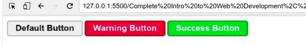
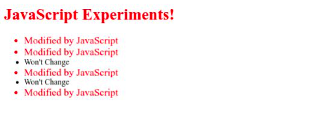

# Complete Intro to Web Development, v2

## Table of Contents

- [Complete Intro to Web Development, v2](#complete-intro-to-web-development-v2)
  - [Table of Contents](#table-of-contents)
    - [Web Development Tools](#web-development-tools)
      - [Tools:](#tools)
      - [Trusted Resources:](#trusted-resources)
    - [Learning HTML](#learning-html)
      - [Basic HTML](#basic-html)
      - [HTML Elements](#html-elements)
      - [HTML Comments](#html-comments)
      - [HTML Attributes](#html-attributes)
      - [HTML Classes](#html-classes)
      - [HTML ID](#html-id)
      - [Meta HTML](#meta-html)
    - [Learning CSS](#learning-css)
      - [Basic CSS](#basic-css)
      - [CSS Rules](#css-rules)
      - [Parents and Children](#parents-and-children)
      - [CSS Selectors and the Cascade](#css-selectors-and-the-cascade)
      - [IDs and !important](#ids-and-important)
      - [Pseudoclasses](#pseudoclasses)
      - [CSS Specificity](#css-specificity)
      - [CSS Box Model](#css-box-model)
      - [CSS Floats and Flexbox](#css-floats-and-flexbox)
      - [Effective Patterns for Coding in CSS](#effective-patterns-for-coding-in-css)
    - [Learning JavaScript](#learning-javascript)
      - [Programming Fundamentals](#programming-fundamentals)
      - [Numbers, Strings and Booleans](#numbers-strings-and-booleans)
      - [Control Flow](#control-flow)
      - [Loops](#loops)
      - [Functions](#functions)
      - [Scope](#scope)
      - [Builtins](#builtins)
    - [Objects](#objects)
      - [Context](#context)
      - [Arrays](#arrays)
      - [Document Object Model(DOM)](#document-object-modeldom)
      - [Events and Listeners](#events-and-listeners)
      - [Event Delegation](#event-delegation)
      - [JavaScript, HTML, and CSS Project](#javascript-html-and-css-project)
    - [Using Ajax and Node.js](#using-ajax-and-nodejs)
      - [Ajax](#ajax)

### Web Development Tools

#### Tools:

- **Browser**: Firefox, \*Chrome, Safari.
- **Editor**: \*Visual Studio Code, Sublime Text 3, Atom, WebStorm, Vim, Emacs.
- **Terminal**: iTerm2, Hyper, fish, zsh.

**Note**: `iTerm2/Hyper/fish/zsh` is an emulator and `bash` is the `shell`.

#### Trusted Resources:

- **\*MDN**(Mozilla Developer Network)
- W3Schools
- **\*CSS-Tricks**
- Documentation

### Learning HTML

#### Basic HTML

[Basic HTML Documentation](https://btholt.github.io/intro-to-web-dev-v2/basic-html)

**Heading**:

```html
<!-- start -->
<h1>Heading 1</h1>
<h2>Heading 2</h2>
<h3>Heading 3</h3>
<!-- ........ -->
<h6>Heading 6</h6>
```

**Correct**:

```html
<div>
  <h1>Hi</h1>
</div>
```

**Incorrect**:

```html
<div>
    <h1>
     Hi
    </div>
</h1>
```

The above is incorrect. I can't close the div before I close the `h1` since the `h1` was the last one I opened.

```html
<!-- Self closing tag or void tag -->
<!-- <input/> tag  take inputs from the user-->
<input />
```

#### HTML Elements

Let's explore some of the essential tag types.

- `<h1>`, `<h2>`, `<h3>`, `<h4>`, `<h5>`, and `<h6>` - Heading. These are the six levels of headings and subheadings you can have. You can see up top of this page we have `HTML` which is an `h1` and then below that we have `Types of Tags` which is an `h2`. An `h2` is a subheading to an `h1` and an `h3` is a subheading to a `h2`. Each page should only have one `h1` tag.

```html
<!-- Heading Tag -->
<!-- most important one -->
<h1>Heading 1</h1>
<!-- 2nd most important and subheading on heading 1-->
<h2>Heading 2</h2>
<!-- 3rd most important and subheading on heading 2-->
<h3>Heading 3</h3>
<h4>Heading 4</h4>
<h5>Heading 5</h5>
<h6>Heading 6</h6>
```

- `P` - Paragraph. You'll put a paragraph of text together inside of a `p` tag. Only text goes in `p` tags. Each one of these paragraphs is a `p` tag.

```html
<p>A paragraph of text</p>
```

- `a` - Anchor. An `a` tag is a link to somewhere else. Every `a` tag needs a destination of where the link should take you.

```html
<!-- Anchor Tag -->
<a href="www.google.com">google</a>
<a href="/file_location">File Location</a>
```

- `div` – Short for division. A div is sort of like a cardboard box. It's not really anything by itself; it's more defined by what's in it. It's a generic container tag for grouping together other things. You'll use a lot of `divs`. Very useful with CSS. In general, you want to group together "like" things into a containing tag (like a div) to keep them together. If you have a website with a list of blog posts that each have paragraphs, titles, images, etc. you'll group each post together in a div or other container-type tag typically.

- `span` – A container for small pieces of text. If a div is like a cardboard box, a span is like a Ziploc bag. It doesn't change the styling of anything by itself but it allows you use CSS and JavaScript later to make that text different in some way. Example: `<p>Here is some text. <span>This text is in a span</span> but it doesn't look any different.</p>`

- `ol, ul, and li` – Both ol and ul represent lists. In fact, this list of various tags is a ul! A ul is an unordered list: it's a list of things that could be shuffled and still mean the same thing. If I asked you to list all the teams in a sports league, or all the characters on a TV show, those could be presented in any order. An ol is an organized list: what comes first matters. If I ask you to list out the ten most populous cities in the world, there is an order to that and changing the order makes the list incorrect. In either list, each item in the list is an li. Example: `<ul><li>Bob</li><li>Eve</li><li>Alice</li></ul>`

- `button` – A … button. A button can be used by JavaScript to respond to a user clicking it, or it can be used by a form to signal a user has completed filling it and it should submit the data. Think of it like a doorbell to your house: you can put the doorbell button there but it's not going to do much unless you connect it to the buzzer. Example: `<button>Click me!!</button>`

- `img` – An image. You use this to load images onto the page. This can be confusing because you can use CSS to bring in images too. The key difference is that when the image is apart of the content, like a diagram that shows data you're talking about or a picture that shows something from the article, it should be an img tag. If it's a nice background image or something that's for decoration of your website, use CSS. An img tag needs a src to say where the image is coming from and alt to say what is in the image for screen readers so that the image will still be useful to blind people, people who are hard of seeing, and Google and Bing search engines. img are always self-closing tags. Example: ``
- `input` – Browser inputs. Sometimes you need to gather input from the user. Luckily for us, the browser is already really good at doing that. It gives us several types of inputs that you can use. You can also have these input tags do numbers, dates, colors, checkboxes, radio buttons, and others. We'll explore them more later when we talk about forms. Inputs are always self-closing tags. Example: `<input />`.

- `textarea` – Similar to an input but for a lot more text. You'd type long-form responses in here that could linebreaks in it (a linebreak happens when you hit "return" or "enter" on your keyboard.) Despite never having anything inside of a textarea, it is not a self-closing tag. HTML is a really old language and so we have to live with some old quirks. Example: `<textarea></textarea>`

- select and option — Sometimes you want to limit a user to a certain group of options to select from. What country you're from, what month you were born in, etc. A select is a user-interactive input that a user can select an option from a dropdown menu. An option is one of the available options. Each option needs a value that will be sent back to the server if the user select that option. What's inside of the option is what shown to the user. Example: `<select><option value="seattle">Seattle</option><option value="portland">Portland</option><option value="san-francisco">San Francisco</option></select>`

- `form `– A group of html tags related to gathering data from a user. This will be some combination of input, textarea, and select tags. You can then use this form element to send that data to your server. A form tag itself doesn't show anything; it's a just a container for the other tags. We'll use them more later. For now, just know they exist. Example: `<form><input /><textarea></textarea></form>`

- `table, tr, and td` – Like making a table in Word or Excel. If you have a table of data, this is the best way to display it. Just for your context, we used to do terrible, awful things with tables to make websites, way back when. Because of that, some tutorial will tell you never ever use tables. That's not good either because when you have tabular data (something you would put into Excel) then tables are very useful. The table is the container for the whole table, tr represents a row, and td represents one cell in the table. Example: ` `<table><tr><td>(0,0)</td><td>(1,0)</td></tr><tr><td>(0,1)</td><td>(1,1)</td></tr></table>`

There are many, many, many more tags. This is just a highlight of some of the more useful, common ones.

#### HTML Comments

We, as coders, forget what things do. We write things that are really complicated or we know will be difficult to figure out later. Something to keep in mind is that you are mostly writing code for yourself to read later, not for the computer. The hardest part of writing code is having to maintain it later, not writing it the first time. Writing code the first time is the easier part. Going back and trying to remember what the hell you were thinking is the hard part.

This is where **comments** can be useful. You can leave little notes in your code that the computer won't read, it'll just ignore them. In HTML, the way you write a comment is `<!-- your comments go here -->`.

#### HTML Attributes

Let's start with a text **input** tag. There are several types of inputs that we discussed in the previous section: `text`, `color`, `checkboxes`, `radio buttons`, etc. How can the browser tell which is meant to be what? HTML **attributes**! Attributes are additional pieces of information that you can attach to HTML tags. We're going to use the type attribute to pass that to the browser.

`type` is considered an **attribute**. Different tags have different **attributes** that they care about. For example, the type attribute is not useful with `p`, `div`, `h1`, etc. You can still put a type attribute on these tags; they'll just **ignore** them.

```html
<!-- type attribute -->
<h3>type attribute</h3>
<input type="text" />
<input type="email" />
<input type="number" />

<h3>placeholder and value attribute</h3>

<input value="This is a pre-filled value" />
<input placeholder="This is a placeholder" />
<input type="checkbox" checked />
<input type="radio" checked />
<input type="checkbox" disabled checked />
<input type="color" value="#FF0000" />
```


**Note**: `inputs` aren't the only ones to use **attributes**. In fact they are used everywhere in HTML. This is just to demonstrate to you what they look like and how certain attributes do certain things. If something isn't working for you, always check to see if you misspelled one of the tag names or attributes; that's an easy thing to mess up and hard to tell it happened.

#### HTML Classes

**Classes** are special attributes that can go on `any tag`, though some you won't use it with. While a class does nothing itself, it allows that tag to be found by your **CSS** and your **JavaScript**. Using our house analogy, you don't want to make a rule that says "all walls are south facing." It's nonsensical and you could never build a house that way. Instead, you'd make a rule that says "walls marked south-facing
-wall are south facing." This is what classes allow you to do: they allow you to mark your HTML so you can write rules and code to govern them later. Let's see what that looks like.

```html
<div class="header">
  <h1 class="header-title">My Great Blog</h1>
</div>
<div class="blog-posts">
  <div class="post">
    <h1 class="post-title">When Not to Overextend House Metaphors</h1>
    <p class="post-text">…</p>
  </div>
  <div class="post">
    <h1 class="post-title">Another Great Blog Post</h1>
    <p class="post-text">…</p>
  </div>
</div>
```

#### HTML ID

**IDs** are far less useful than classes. Whereas you'll be using classes everywhere and frequently, you should be using IDs very sparingly. As you see in our above blog-posts HTML, we can `re-use classes` like post and post-title. This is extremely important. As a coder, you want a piece of code and use it a lot. As coders, we want to write as little code as possible (which we'll explore why later, for now trust me.) For now, be satisfied that I get to write a little bit of code that governs post and have it affect every post on the page.

Let's contrast that with IDs. `When you designate something with an ID, you're affirming that this is the only one of those on your website. Not even just that page, but your whole website`. Sometimes that is useful; just not very often. Some other coders and tutorials will tell you to never use IDs; I think that's misguided. IDs are a sledgehammer. Most problems don't require a sledgehammer. However sometimes you have problems that need a sledgehammer and then you're really grateful that you have one.

Let's see what an ID would look like:

```html
<div class="header">
  <h1 class="header-title">My Great Blog</h1>
</div>
<div class="blog-posts">
  <div id="house-metaphors-post" class="post">
    <h1 class="post-title">When Not to Overextend House Metaphors</h1>
    <p class="post-text">…</p>
  </div>
  <div class="post">
    <h1 class="post-title">Another Great Blog Post</h1>
    <p class="post-text">…</p>
  </div>
</div>
```

**Note**: Another reason that is very useful about IDs is that I now can make a **link** that takes you directly to that ID in the page. Try clicking this link (it won't leave this page.)

**The link should bring you here.**:

This is done using just an ID. The code for that link is:

```html
<a href="#the-h1-part-way-down-the-page">link</a>.
```

That `#` means go to that `ID` on the page.

#### Meta HTML

So far we've just shown you HTML that produces something concrete, something visual. We now need to talk about HTML that you still need but it won't produce visual things.

Let's start with the absolute basic foundations for an HTML page. Like a house needs a foundation, your HTML document needs a basic framework to get up and going.

```html
<!DOCTYPE html>
<html lang="en">
  <head>
    <title>My amazing HTML Document</title>
  </head>
  <body>
    <h1>Check this out</h1>
    <!-- Your amazing HTML here -->
  </body>
</html>
```

### Learning CSS

#### Basic CSS

Okay, now we've began putting HTML elements on a page. Using our house-building analogy, this is like we have all the materials now in a pile in front of our house. However a pile of lumber does not make a house. We're going to start reasoning about how to put together these things, how to create our blueprints, our plans. CSS is really powerful and can accomplish a wide variety of things: **colors**, **sizes**, **order**, **positioning**, **hiding**, **showing**, **animation**, etc. We'll scratch the surface here, but know you can do a lot with just CSS. It's a deep subject and a powerful tool.

Like HTML, CSS is not a programming language. It's a **list of rules** that you give the browser. You'll provide rules to the browser like "all h1s will be colored red." We'll explore why this is different than **JavaScript** later, but know that's the gist.

#### CSS Rules

```css
/* Selector {
    property : value;
} */

h1 {
  color: red;
}
```

That's it! There's your first CSS. Let's dissect each piece of this rule:

- **h1** — This is what we'd call the **selector**. Anything that matches this selector is going to have everything inside the `{ }` applied to it. These selectors can be a wide variety of things but for now we're just selecting every h1 on the page. That's important to keep in mind too: it'll apply the changes to everything that matches that selector.

- **color**: – This is called the **property**. There are about `~350 properties` that you can use but to be honest you'll never use all of them. Maybe fifty to a hundred are used frequently and the rest are a long tail that are rarely used. The color property affects the color of the font (as well as some other things, but for now just assume it means font color.)

- **red** – This is the **value**. This identifies what the value of the property is going to be. In this case, we're telling the color to be red. There are variety of ways to define color in CSS. This is called using "named color", of which there are about 150 different colors that CSS understands. CSS also understands hex values like #**ff0000**, rgb values like **rgb(255, 0, 0)**, and hsl values like **hsl(0, 100%, 50%)**. All those values I gave in the previous sentence are the same color as red. You don't actually need to understand how these values work to understand web programming or CSS and I would assert most web developers don't. If you need to understand, here's a great article on it from **CSS Tricks**.
- **;** – **Every property-value pair will end in a semicolon**. Think of it like a period/full-stop to end of a sentence. This is how the computer knows you're done with that property and moving on.

So let's go a step further. Let's make our h1 even more different! Let's make it **limegreen**, **bigger**, not **bold** (h1s are by-default bold), **underlined**, **uppercased**, and have pink border!

```css
<body>
    <style>
        h1 {
            color:blue;
            font-size: 40px;
            font-weight: normal;
            text-decoration: overline;
            text-transform: uppercase;
            border: 3px solid green;
        }
    </style>
    <h1>
        This is h1
    </h1>
</body>
```


#### Parents and Children

You'll notice that if I have HTML like this:

```html
<div>
  <h1>An h1</h1>
</div>
```

And I have CSS that looks like this:

```css
div {
  color: blue;
}
```

The `h1` will be colored **blue**. This is because it has a **parent** (or **ancestor**) tag that is a div which means that CSS will still affect it. This even works will large degrees of separation.
If I have `<body><div><div><div><div><div><h1>my h1</h1></div></div></div></div></div></body>` and my CSS selector is `body { color: orange }` that will affect the `h1` in the middle.

---

`Please see ./scripts-and-codes/html_css_interaction_1.html and css` code.

#### CSS Selectors and the Cascade

- In this one, we have two rules with the same class (which is "legal" CSS.) So which one gets applied? Since they're equal, the one that comes last wins.

```html
<style>
  .title {
    color: red;
  }

  .title {
    color: green; /*applied*/
  }
</style>
<h1 class="title">Cool Title</h1>
```


- First of all, yes, one tag can have multiple classes, and that can be useful. Okay, so what is this going to look like? In the eyes of CSS, those two selectors are equal since they both have the same specificity (key word, you'll see it used a lot when talking about CSS.) They both specific one class which makes them equal. So in this case, since .title comes last in the CSS, it wins. The color will be green. What about the border? Since .title doesn't conflict, it'll have a black border too. So keep in mind that each of these "conflicts" is resolved on a property-by-property basis. So the end result in an h1 that has a black border and green font.

```html
<style>
  .main-brand-2 {
    border: 1px solid black; /*applied*/
    color: red;
  }

  .title-2 {
    color: green; /*applied*/
  }
</style>
<h1 class="title-2 main-brand-2">Branding here</h1>
```


- This how you add two classes to one selector. Notice there's no space between the two class names (that means something else.) The selector .main-brand.title will only match a tag that has both classes. If has only one of the two, it will not match. As you may imagine, since it has two classes, it's more specific, and therefore it wins.

```html
<style>
  /* if you put any space between 3.title you just break the specificity or more specific*/
  .main-brand-3.title-3 {
    color: red; /*applied*/
  }

  .title-3 {
    color: green;
  }
</style>
<h1 class="title-3 main-brand-3">Branding here</h1>
```


- **Classes are more specific than tags**.

```text
1 class = 10 points
1 tag = 1 points

## Some Calculations
-------------------------------------------------------
h1.main-brand-5         = 1 + 10     = 11 points
.main-brand-5.title-5   = 10 + 10    = 20 points # wins
.main-brand-5           = 10         = 10 points
```

**Example-1**:

```html
<style>
  .title-4 {
    color: orange; /*wins*/
  }

  h1 {
    color: green;
  }
</style>
<h1 class="title-4">Another h1</h1>
```

**Example-2**:

```html
<style>
  h1.main-brand-5 {
    color: red;
  }

  .main-brand-5.title-5 {
    color: orange; /*wins*/
  }

  .main-brand-5 {
    color: green;
  }
</style>
<h1 class="title-5 main-brand-5">Another Example</h1>
```

#### IDs and !important

**ID**: **ID** is more **powerful** than **class**.

```html
<style type="text/css">
  #site-brand {
    color: red; /*-----------wins----------*/
  }

  h1.nav-head.nav-main.other-useful-class {
    /*
     * this class is way too specific; never have a class selector so long
     * it's ridiculous and just to illustrate a point
     */
    color: green;
  }
</style>
<h1 id="site-brand" class="nav-head nav-main other-useful-class">
  The Brand of my Website
</h1>
```

**!important**: `!important` is more powerful than `ID`.

```html
<style>
  #site-brand-2 {
    color: red;
    border: 1px solid red;
  }

  .nav-head-2 {
    color: green !important; /*----- wins -----*/
    border: 1px solid green;
  }
</style>
<h1 id="site-brand-2" class="nav-head-2 nav-main-2 other-useful-class-2">
  The Brand of my Website
</h1>
```

#### Pseudoclasses

- **hover**:

```html
<style>
  .hover-example {
    width: 100px;
    height: 100px;
    background-color: limegreen;
    color: white;
  }
  .hover-example:hover {
    background-color: crimson;
    width: 150px;
    height: 150px;
  }
  .hover-example.hover-example {
    background-color: blue;
  }
</style>
<div class="hover-example">Hover your mouse over me.</div>
```

- **Other**: `nth-child(formula)`, `first-child`, `last-child`
- **Note**: formula -> `even`, `odd`, `2`, `2n + 1`, `2n + 7` etc.

#### CSS Specificity

Learn in **CSS in Depth V2** course on front-end-master.

#### CSS Box Model

**The Box Model**


- **Padding** is inside the border.
- **Margin** is outside the border.

```html
<style>
  .example {
    border: 2px solid red;
    padding: 2px;
    margin: 20px;
    background-color: white;
  }
</style>
<div class="example"></div>
```

- **margin** – This is the space outside of the element between it and other elements. It is outside of the border. If you give something a background-color, it will not color in the margin space. This is used to space elements out from other elements.
- **border** – Next is the border. If your element has a border, it comes next (not everything has or needs a border.)
- **padding** – Inside the border is the padding. This is the spacing inside the element. If you give something a background-color, you will color the padding space. In our diagram above, you can see the space between the red, solid border and the green, dashed border. This is the padding of the element.

Right now, the above element doesn't have a set **height** or **width**, which means it will take its height from what ever inside of it and it will try to take `100% of the width` it can. We can modify both of these. However, if I say width: 200px, what is 200px wide? Unfortunately, the answer is it depends. It depends on what the value of the `box-sizing` property. By default, it does things the old way of writing code which if I say width: 200px I am not including the border or the padding. This is annoying because if I'm trying to fit things together well, it's much easier to include border and padding. Remember how I told you to never use the wild card selector before? This is the one exception where I permiss you to:

```css
* {
  box-sizing: border-box;
}
```

This will make everything use the `border-box` sizing instead of the default one (which is called `content-box` but you'll never have to know that.) This is the first thing I put in every project I start. You'll need it once in one file. This will make everything by-default be border-box and thus be easier to work with. This used to be controversial to use but here is Paul Irish (really smart guy who works on Google Chrome) saying it's okay.

#### CSS Floats and Flexbox

**Floats**:

- `float: left;` push everything in the left.
- `float: right;` push everything in the right. Just reverse.

```html
<body>
  <style>
    .box-1 {
      border: 1px solid black;
      color: white;
      background-color: blue;
      height: 150px;
      width: 300px;
    }
    .box-2 {
      border: 1px solid black;
      color: white;
      background-color: red;
      height: 100px;
      width: 300px;
    }
    .box-3 {
      border: 1px solid black;
      color: white;
      background-color: green;
      height: 200px;
      width: 100px;
    }

    .floated box {
      /* float: right */
      float: left;
    }
  </style>
  <div class="floated">
    <div class="box box-1">Box-1</div>
    <div class="box box-2">Box-2</div>
    <div class="box box-3">Box-3</div>
  </div>
</body>
```

**Flex**:

`display: flex`

`display: flex;` is a display mode for CSS. It's to note that when you stick display: `float`, it allows you to to change the layout inside the tag. It allows you to change the layout of its **children**. Externally, it acts just like block. Likewise there is a inline-flex which acts just like display: inline-block externally.

```html
<style>
  .flex-container {
    /* flex-inline */
    display: flex;
    width: 100%;
    border: 1px solid black;
  }
  .reverse {
    /* column-reverse, column */
    flex-direction: row-reverse;
  }
</style>

<div class="flex-container reverse">
  <div class="box box-1">Box-1</div>
  <div class="box box-2">Box-2</div>
  <div class="box box-3">Box-3</div>
</div>
```

**Justify Content**:

- By default, the `justify-content` is `flex-start` which is like `left-justified`.

- This one puts the first on the left most and the last on the right most. It then aims to space out the items in the middle equally. Very useful for laying out columns on your web page. The last two are space-around and space-evenly. I'm just showing you space-around but space-evenly is very similar. Feel free to read more into it if you're interested.

```html
<style>
  <style>
  /* justify-content */
  .jc {
    /* default: flex-start */
    /* other: center, space-between, space-around */
    justify-content: center;
  }
</style>
```

**Align Items**:

```html
<style>
  /* align-items */
  .ai {
    /* flex-end, flex-start, center */
    align-items: stretch;
    height: 250;
  }
</style>
```

**Flexing** in one place......

```html
<body>
  <style>
    .box-1 {
      border: 1px solid black;
      color: white;
      background-color: blue;
      height: 150px;
      width: 300px;
    }
    .box-2 {
      border: 1px solid black;
      color: white;
      background-color: red;
      height: 100px;
      width: 300px;
    }
    .box-3 {
      border: 1px solid black;
      color: white;
      background-color: green;
      height: 200px;
      width: 100px;
    }

    /* display flex */
    .flex-container {
      /* flex-inline */
      display: flex;
      width: 100%;
      border: 1px solid black;
    }
    /* flex-direction */
    .reverse {
      /* column-reverse, column */
      flex-direction: row;
    }
    /* justify-content */
    .jc {
      /* default: flex-start */
      /* other: center, flex-end, space-between, space-around */
      justify-content: space-around;
    }
    /* align-items */
    .ai {
      /* flex-end, flex-start, center */
      align-items: center;
      height: 250;
    }

    /* remove the height from the three boxes */
    .no-height {
      /* 
      height: 100% will match the height of the element's parent, regardless of the parent's height value.

      height: inherit will, as the name implies, inherit the value from it's parent. If the parent's value is height: 50%, then the child will also be 50% of the height of it's parent. If the parent's size is defined in absolute values (e.g. height: 50px), then height: inherit and height: 100% will have the same behavior for the child.
       */
      height: inherit;
    }

    /* higher order push right 
     * if you use row-reverse or column reverse as direction than 
     * higher order push left. 
    */
    .box-2 {
      align-self: end;
      order: 5;
    }

    .box-1 {
      align-self: end;
      order: 4;
    }

    .box-3 {
      align-self: end;
      order: 3;
    }
  </style>

  <div class="flex-container ai jc reverse">
    <div class="box box-1">Box-1</div>
    <div class="box box-2">Box-2</div>
    <div class="box box-3">Box-3</div>
  </div>
</body>
```

**Note**: See `CSS Tricks` for **Flexbox**.

#### Effective Patterns for Coding in CSS

- Using `<link>`
- The key here is the `<link rel="stylesheet" href="./style.css" />`. Let's break it down. A `link tag` is nearly always found in the `head` and links another file to that HTML document. Nearly always (99.9% of the time), it's to a stylesheet, hence the `rel="stylesheet"`. The href is where that other file is located. It refers to the file name. In this case, we have a file called style.css and it is located in the same folder as the index.html file, which is what the `./` part of the `./style.css` means. You could also write it as `"style.css"` if it's in the same directory, it also means it's located in the same folder, but I wanted you to see the `./ because you'll see it everywhere`. We'll cover how it works later when we start working more with the **terminal**.

```html
<!-- linking -->
<link rel="stylesheet" href="effective-pattern.css" />
```

**When to Actually Use the Cascade**:

Before I told you to use the cascade as little as possible, but I did want to share with you when it can be useful to use. Imagine we have the following **three buttons**:

`./scripts-and-codes/effective-pattern.css`

```css
.ex-btn {
  background-color: #eee;
  border: 2px solid #aaa;
  padding: 4px 15px;
  border-radius: 5px;
  font-weight: bold;
  font-size: 17px;
  cursor: pointer; /*Changes the mouse when hover the mouse*/
}

.ex-btn-warn {
  /* inherits from .ex-btn */
  color: white;
  background-color: crimson;
  border-color: darkred;
}

.ex-btn-success {
  /* inherits from .ex-btn */
  color: white;
  background-color: limegreen;
  border-color: green;
}
```

`./scripts-and-codes/effective-pattern.html`

```html
<!DOCTYPE html>
<html lang="en">
  <head>
    <meta charset="UTF-8" />
    <meta http-equiv="X-UA-Compatible" content="IE=edge" />
    <meta name="viewport" content="width=device-width, initial-scale=1.0" />
    <title>Document</title>

    <!-- linking -->
    <link rel="stylesheet" href="effective-pattern.css" />
  </head>
  <body>
    <button class="ex-btn">Default Button</button>
    <button class="ex-btn ex-btn-warn">Warning Button</button>
    <button class="ex-btn ex-btn-success">Success Button</button>
  </body>
</html>
```



These buttons are relatively similar and differ only in colors but the spacing and text styling are all the same. It'd be nice if we could write the common styles in one rule and then overrule just the colors. We can, using the cascade!

Since those classes come lower on the page, they "win" on the properties that they conflict with, and thus we only overwrite the things we want. Why is this better? Imagine later you want to change the text to be smaller and the border to be thinner. Now instead of having to change the style for each button, you change it once in their common class, .ex-btn and that affects all of them! This principle is generally called DRY which stands for "don't repeat yourself", meaning if you can have one place for common code or rules, it's better to do that than have it in 50 different places. While having three copies of the same rules doesn't seem like a big deal, many websites will have 10+ sorts of buttons and it quickly becomes impossible to manage.

**Project**:

**Newly Tricky Things I learn**:

- Section and Div Pretty Same
- `section.row*2` gives you `2` `section` tag with class row
- `li.nav-item*5>text` give `5` `list` tag with class nav item and content `text`.
- For multi cursor selection hold `alt` key and point each position using your mouse.
- `ctrl + Right Arrow` shift all the cursor after the word.

```css
.box-1 {
  width: 25%;
}
.box-2 {
  width: 50%;
}
.box-3 {
  width: 25%;
}

/* same as */
.box-1 {
  flex: 1;
}
.box-2 {
  flex: 2;
}
.box-3 {
  flex: 1;
}
```

> **Full Code**: `./scripts-and-code/project-index-html-css.html` and `./scripts-and-code/project-index-html-css.css`

**Flexbox Resources**:

Search on **Google**,

1. CSS Tricks
2. Flexbox Froggy
3. Flexbox Zombies

### Learning JavaScript

#### Programming Fundamentals

**What is code?**:

A dumb question but its answer may surprise you. `Code is for humans first and computers second`. You can think of writing code as essentially writing notes on how to solve a particular problem that just happens to be in a way that computer can understand it.

Wait, why? The why is because you or someone else will have to go back and re-read that code some time in the future, maybe tomorrow or maybe in ten years (I've worked on code older than 10 years old, it's not fun.) As such, `it's important to write code in a such way that it's easily understandable to someone with little context`. You will spend far longer maintaining this code than you will writing it the first time. Be explicit. Be deliberate. The point here is not to be clever but to be simple and to communicate clearly. **Code is communication.**

Okay, given this, let's frame how this code works then. When you write code, the computer breaks it down into smaller pieces it can understand and then executes those one bit at a time. With JavaScript, only one thing is ever happening at a time (this is called being **single threaded** but that is not a term you need to know.) In general, this means it executes line 1, then line 2, then line 3, etc.

```js
const monthlyRent = 500;

const yearlyRent = monthlyRent * 12;
console.log(yearlyRent);
```

**Output**:

```text
6000
Undefined
```

The first thing that happens above is that we **declare a variable**, `monthlyRent`. The **const** keyword is how we let JavaScript know we're declaring a variable. Variable names always have to know no spaces in them, which is why we squish the words `"monthly rent"` together. In order to make this more readable, we use what's called camel casing, so-called because the capital letters in the middle make it look like humps on a camel. You can also use other styles of capitalization, there's no rule it must be camel case in JavaScript; everyone just happens to do camel casing in JavaScript.

Notice the `;` at the end of every line. `This semi colon lets JavaScript know you've completed your thought`. Think of this as the period/full-stop of the the programming world.

`Variable can be called almost anything. You can't use keywords.` An example would be `const const = 15`. const is a keyword so it can't be used as a variable name. You do want to give your variables good names. `Imagine we have a huge file and 200 lines below we see the variable named monthlyRent`: we'll know instantly what this variable does and we won't have to go try to read the code to figure it out. Always, always, `always use good variable names`. Seriously. Put time into it. Naming things is hard and it's a big part of your job.

Okay, so after line one, I have a variable named `monthlyRent` that I can use as much as I want. In this case, it represents the number of 500 but it also semantically represents `monthlyRent`. Imagine if I had 1000 lines between where `monthlyRent` is declared and where yearlyRent is calculated. I could have just put 500 directly in yearlyRent but I don't because I now understand how that's calculated just by reading the code. Use variables. Use them everywhere. It makes your code way easier to read. Also, later, if my monthly rent changes, I can change it one place and everywhere I reference `monthlyRent` gets updated automatically. Powerful stuff.

Okay, I think calculate yearlyRent. I use the _ to represent multiplication. I'm also mixing variables and numbers which is just fine. I also could have said const `yearlyRent = monthlyRent _ monthsInAYear;` (assuming I put const monthsInAYear = 12; somewhere else) too and that would be a good idea. I would argue the two are roughly the same since it's obvious there are 12 months in a year. But you do what you think is most clear. That's your job.

`console.log(yearlyRent);` is going to print whatever is stored in yearlyRent to the JavaScript console. The JavaScript Console is a part of the dev tools. If you need help finding them, see here. We'll explain how it works in a bit but for now just know that anything you put between the **parenthesis's** gets logged out to your JavaScript console.

Let's get this little snippet working in our browser. Make a new folder (I'll just a put it on my desktop) and add an index.html file with the following in it:

```html
<!DOCTYPE html>
<html lang="en">
  <head>
    <title>JavaScript Experiments</title>
  </head>
  <body>
    <h1>JavaScript Experiments!</h1>
    <script src="./experiments.js"></script>
  </body>
</html>
```

That script tag is going to let us load JavaScript code into out HTML page. So make another file in the same folder called `experiments.js` (it really can be called anything as long as the script tag matches it.) Then in the that JS file put our code from above:

```js
const monthlyRent = 500;

const yearlyRent = monthlyRent * 12;
console.log(yearlyRent);
```

```text
6000
undefined
```

#### Numbers, Strings and Booleans

**Strings**:

- The first way is the old way. We can use the + to tell JavaScript to connect two strings. Notice how we have insert the space between `firstName` and `lastName`. The computer only does exactly what you tell it to do. If you don't insert that space, it doesn't get put there.

- The second line is the new way of doing this. JavaScript got a large update in 2015 and it made things a lot easier. Now you can use the back tick (notice the first uses a double quote, you must use back ticks to do **template** strings) to do template strings. If you do that, anything inside of `${yourVariableHere}` gets output in the string. Cool, right?

```js
// strings
const myName = "Md. Nahid Hassan";
console.log(myName);

// concatenation
const firstName = "Md. Nahid";
const lastName = "Hassan";

// direct concatenation
const sentence = "Hello " + firstName + " " + lastName + "! How are you?";

// Templates
// `  ${variableName}  `
// `` called backtick
const sentenceWithTemplate = `Hello ${firstName} ${lastName}! How are you?`;

console.log(sentence);
console.log(sentenceWithTemplate);
```

**Booleans**:

- `true` and `false`

Sometimes you just need a simple **true** or **false**. These are where booleans are useful. Something like a light switch's state is best represented by a boolean. A light is either on (true) or off (false). You'd have something like `const lightIsOn = true;`. Useful and you'll see them everywhere.

**Number**:

Some languages separate **integers** (whole numbers, like `1, 2, 3, 4, 500, 1000`) and **floats** (`1.2, 3.14159, 14.01`, etc.) differently but not JavaScript. JavaScript just has one type of number, Number. A number is a number.

#### Control Flow

```js
// Example - 1
const skyIsBlue = true;

if (skyIsBlue) {
  console.log("The sky is blue.");
} else {
  console.log("The sky is not blue.");
}

// Example - 2
if (2 + 2 === 4) {
  console.log(
    "Oh thank god, the fundamental principles of mathematics still hold true."
  );
} else {
  console.log("Uh, panic?");
}
```

You can put any expression (a technical terms, means anything you can stick on the right side of an equal sign, we'll explore it more as we go) inside of the if statement. In this case, we are asking, is two plus two still equal to four. If this is true (I hope so) then again the first block will be run. If not, the second will be.

Let's talk about `===` for a second. If you use just one `=` in JavaScript, it means is `assigned to`. So when we have `const isBrianCool = true;` you can verbalize that as "The variable isBrianCool is assigned to true". Thus we can't use that inside of the if statement because that's not we mean. We're trying to ask a question, not assign something. We're trying to ask "is two plus two equal to four." Enter the triple equals. Triple equals is the same as asking "is this equal to that." We use the triple equals instead of the double equals because double equals does a lot of funny business that usually we don't want it to do. It does what's called coercion and we'll talk about that below. But in an example 2 == "2" but it does not 2 === "2". String 2 is double equal to number 2 but string 2 is not triple equal to number 2.

There's also `!==`. This is asking `"is this not equal to that"`. Lastly you can ask with numbers `>` `>=` `<` `<=` as well to ask if numbers less than or greater than too. For another example:

```js
const friendsAtYourParty = 10;

if (friendsAtYourParty === 0) {
  console.log("Cool, now I have a lot of nachos to myself.");
} else if (friendsAtYourParty >= 4) {
  console.log("Perfect amount to play some Mario Kart.");
} else {
  console.log("Wooooo turn on the dance music!");
}
```

#### Loops

Okay so now what if I want do one thing multiple times? I could do something like this

```js
let friendsAtYourParty = 0;
friendsAtYourParty = friendsAtYourParty + 1;
friendsAtYourParty = friendsAtYourParty + 1;
friendsAtYourParty = friendsAtYourParty + 1;
friendsAtYourParty = friendsAtYourParty + 1;
friendsAtYourParty = friendsAtYourParty + 1;
friendsAtYourParty = friendsAtYourParty + 1;
friendsAtYourParty = friendsAtYourParty + 1;
friendsAtYourParty = friendsAtYourParty + 1;
friendsAtYourParty = friendsAtYourParty + 1;
friendsAtYourParty = friendsAtYourParty + 1;
console.log(friendsAtYourParty);
```

That's annoying though. I wish there was a better way. Before we explore that, let's chat about this example a tad more.

We used `let` instead of `const`. Things that are `const cannot be reassigned later`. In general I find this be of minor help but others do not so I leave you to make your own judgement call. In general one should try to follow the `"principle of least power`." You should always choose the least powerful "thing" to accomplish whatever you're trying to do. Things with less power tend to be simpler and simple things are less prone to having or causing bugs. We instead use let here because you can see on the subsequent lines we do reassign friendsAtYourParty to be a different number. If you used const your code would crash because const won't let you do that. Thus here we use `let`. There's another one called `var` that is the **old** way of doing JavaScript. There are differences but I don't see a reason to use var at all anymore. It behaves more similar to let.

Okay, so, we want to do this better, let's explore a few ways to do that using loops.

```js
let friendsAtYourParty = 0;
while (friendsAtYourParty < 10) {
  friendsAtYourParty = friendsAtYourParty + 1;
}
console.log(friendsAtYourParty);
```

**Output**:

```text
10
```

This is a **while loop**. The first part works similar to an if statement: as long as what's inside that statement is true `it will continue running and re-running the body (what's between the { })` until that statement is false. Once that statement is false, it'll break the loop and continue on. This case, we `add 1` to friendsAtYourParty until it's `10`, and then the next loop, when it's 10, it'll stop because 10 is not less than 10.

**Infinite Loop**:

```js
let i = 0;

while (true) {
  i++;
  console.log(i);
}
```

Also, let's just show you a few shortcuts for adding one to a thing,

```js
let friendsAtYourParty = 0;
friendsAtYourParty = friendsAtYourParty + 1;
friendsAtYourParty += 1;
friendsAtYourParty++;
++friendsAtYourParty;
console.log(friendsAtYourParty);
```

**For Loop**:

```js
let friendsAtYourParty = 0;
for (let i = 0; i <= 10; i++) {
  friendsAtYourParty += 1;
}

console.log(friendsAtYourParty);
```

#### Functions

A function is a bit of re-usable code. Just how we like to re-use CSS classes, we love to re-use code. Let's start with an example:

```js
function addTwo(number) {
  return number + 2;
}

const finalAnswer = addTwo(5);
console.log(finalAnswer);
```

This isn't super useful but hopefully it shows you the mechanics of how a function works. We created a function called addTwo. This function takes in one parameter, number and it returns that number with 2 added to it. We can now use that addTwo function as much as we want! Let's make a something a bit more useful.

```js
function greet(firstName, lastName, honorific, greeting) {
  return `${greeting} ${honorific} ${lastName}! I’m extremely pleased you could join us, ${firstName}! I hope you enjoy your stay, ${honorific} ${lastName}.`;
}

console.log(greet("Brian", "Holt", "Lord", "Salutations"));
console.log(greet("Jack", "Sparrow", "Captain", "A-hoy"));
```

**Result**:

```text
"Salutations Lord Holt! I’m extremely pleased you could join us, Brian! I hope you enjoy your stay, Lord Holt."
"A-hoy Captain Sparrow! I’m extremely pleased you could join us, Jack! I hope you enjoy your stay, Captain Sparrow."
undefined
```

Note:

```js
function addTwo() {
  return 10 + 2;
}
// return the function, not invoke the function
const finalAnswer = addTwo;
console.log(finalAnswer()); // now function is invoke
```

#### Scope

```js
const A = "A";
let F;

function doStuff(B) {
  console.log(B); // works, B parameter is still in scope
  const C = "C";
  let H = "H";
  if (1 + 1 === 2) {
    const D = "D";
    H = "something else";
  }
  console.log(D); // does not work, D was declared in that if statement block
  console.log(H); // works, H was declared outside the if statement
  F = "F";
}

let E = 0;
while (E < 3) {
  E++;
  console.log(A); // works, the outer block (called the global scope) is still in scope
  const G = "G";
}
console.log(E); // works, E was declared outside the while loop
console.log(G); // does not work, declared inside the while loop and it's over

doStuff("B");
console.log(B); // does not work, the B parameter expires after the function call
console.log(C); // does not work, C was declared inside the function and the function is over
console.log(F); // works, F was declared in the global scope
```

**Results**:

```text
"A"
"A"
"A"
3
ReferenceError: G is not defined
```

#### Builtins

Lots of functions already exist for you! Smart people have created this commonly-used functions for things we often need. For example, say you have a string and you want to make everything lowercase, you can do this:

```js
const sentence = "ThIs HaS wEiRd CaSiNg On It";
console.log(sentence.toLowerCase());
```

```text
"this has weird casing on it"
```

Always be looking for the parent. And the best place to look all this stuff up is from our friends at Mozilla (makers of Firefox): the MDN. MDN used to stand for "Mozilla Developer Network" I think but now it's just synonymous with the documentation for the web. I literally look at this website several times a day. As I said before, you are not expected to remember everything. Looking things up on the MDN is not cheating.

You can call `Math.round(5.1)` and it'll return that number `rounded (in this, 5).` You can use string.substr(indexToStart, howManyCharactersToInclude) to return part of a string. For example `const name = "Brian Holt"; console.log(name.substr(6, 3)) logs out "Hol" (remember numbering starts at 0).` We'll introduce them as we go but know there are a lot of them. You'll learn by doing.

```js
console.log(Math.round(5.1));

const name = "Brian Holt";
console.log(name.substr(6, 3));
```

### Objects

So far we've talked about having one variable at a time: one first name, one last name, one price, etc. What if we have a collection of data? It'd be nice to group together like data. Good news! You can!

```js
const person = {
  name: "Brian Holt",
  city: "Seattle",
  state: "WA",
  favoriteFood: "🌮",
  wantsTacosRightNow: true,
  numberOfTacosWanted: 100,
};
console.log(person);
console.log(person.name);
console.log(person["name"]); // same as the line above; definitely prefer using the other one
```

**Result**:

```text
Object {
  "city": "Seattle",
  "favoriteFood": "🌮",
  "name": "Brian Holt",
  "numberOfTacosWanted": 100,
  "state": "WA",
  "wantsTacosRightNow": true,
}
"Brian Holt"
"Brian Holt"
undefined
```

This is called an **object**. They're `extremely useful in JavaScript`; they're how you'll group together like-information so that they can be used together. They contain a bunch of **keys** and **values**. The keys are on the left side of the `:` and represent how you get that piece data of out of the object. name is one such key, and the way I get the name of the.

Used in conjunction with functions they're very powerful. Take this example:

```js
const person1 = {
  name: "Brian",
  ageRange: "25-35",
};
const person2 = {
  name: "Jack",
  ageRange: "65-75",
};

function suggestMusic(person) {
  if (person.ageRange === "25-35") {
    console.log("We think you'll like Daft Punk your crazy millenial.");
  } else if (person.ageRange === "65-75") {
    console.log(
      "You're obviously going to like Johnny Cash. He walks the line."
    );
  } else {
    console.log(
      "Uh, maybe try David Bowie? Everyone likes David Bowie, right?"
    );
  }
}

suggestMusic(person1);
suggestMusic(person2);
```

**Result**:

```text
"We think you\'ll like Daft Punk your crazy millennial."
"You\'re obviously going to like Johnny Cash. He walks the line."
undefined
```

Now we're able to pass all this information as one package which makes it easy to keep track of since we're just passing one variable. You'll see this become even more useful as we start integrating with servers and APIs.

Objects can even have their functions! Let's see that.

```js
const dog = {
  name: "dog",
  speak() {
    console.log("woof woof");
  },
};

dog.speak();
```

#### Context

```js
const me = {
  name: {
    first: "Brian",
    last: "Holt",
  },
  location: {
    streetNumber: 500,
    street: "Fakestreet",
    city: "Seattle",
    state: "WA",
    zipCode: 55555,
    country: "USA",
  },
  getAddress() {
    return `${this.name.first} ${this.name.last}
${this.location.streetNumber} ${this.location.street}
${this.location.city}, ${this.location.state} ${this.location.zipCode}
${this.location.country}`;
  },
};

console.log(me.getAddress());
```

**Result**:

```text
"Brian Holt
500 Fakestreet
Seattle, WA 55555
USA"
```

```js
console.log(this === window); //true
console.log(this.scrollY);
console.log(window.scrollY);
```

#### Arrays

```js
const daysOfTheWeek = [
  "Monday",
  "Tuesday",
  "Wednesday",
  "Thursday",
  "Friday",
  "Saturday",
  "Sunday",
];
console.log(daysOfTheWeek);
console.log(daysOfTheWeek[0]);
console.log(daysOfTheWeek[1]);
console.log(daysOfTheWeek[6]);
```

**Array Property Length**:

```js
const primeNumber = [2, 3, 5, 7, 11, 13, 17, 19];

console.log(primeNumber.length);
```

**Array Function Join()**:

```js
console.log(primeNumber.join("|"));
```

```js
const courses = [
  { teacher: "Kyle Simpson", course: "JS Function Lite" },
  { teacher: "Sarah Drasner", course: "Intro to Vue" },
  { teacher: "Brian Holt", course: "Complete Intro to React v3" },
  { teacher: "Steve Kinney", course: "State Management" },
];

//   push()
courses.push({ teacher: "Md. Nahid Hassan", course: "AI using Python" });
console.log(courses);

// change course instructor and course name from index 2 or 3rd row
courses[2] = { teacher: "Mahin", course: "Geometry" };
console.log(courses);

// change course name for teacher Nahid
courses[4].course = "Machine Learning using Python3";
console.log(courses);

// extract every element from the array

// method -1
for (let i = 0; i < courses.length; i++) {
  console.log(courses[i].course.toLocaleUpperCase() + " Interested.......");
}

// method -2
courses.forEach(function (course) {
  console.log(course);
});
```

#### Document Object Model(DOM)

The **DOM** is the way that **JavaScript** interacts with HTML and CSS.

**The DOM**:

So far we've been writing code pretty well in a vacuum. We've been using console.log as the output mechanism. We haven't really done anything in JavaScript that couldn't be done in any other language. Now we're going to start using JavaScript to interact with your webpage.

Let's first chat about what a browser is and how your code gets from you writing it to being on run in a browser.

In a typical circumstance.

- You write code in your editor (like VSCode)
- You put your code on a server so that other people can get it
- Someone visits your website
  - (Lots of stuff happens here. For now we're not going to talk about it)
  - Their browser makes a request to your server for your index.html
  - Your server sends them a copy of the html
  - The browser reads the HTML, sees you have a my-script.js script tag on there
  - Browsers makes another request for my-script.js from your server
  - Your server sends them a copy of my-script.js
  - The browser reads the JavaScript code and begins executing the code

Same **process** happens with **CSS** too.

Okay, so this is how it works if you have put your code on some server like in a cloud like **Microsoft Azure**, **Amazon Web Services** or other places like **Bluehost** or **GoDaddy**. So how are we doing it locally, without a server, just on our computers? Your computer is basically faking this process. It's acting as both the server and the client so that it's easier for you to write code. When you open a file in your browser from your computer, your hard drive is the server. This was a point of confusion for me when starting so I'm sharing it with you.

**Example**:

**HTML Part**:

```html
<!DOCTYPE html>
<html lang="en">
  <head>
    <meta charset="UTF-8" />
    <meta http-equiv="X-UA-Compatible" content="IE=edge" />
    <meta name="viewport" content="width=device-width, initial-scale=1.0" />
    <link rel="stylesheet" href="./experiment-js-index.css" />
    <title>JavaScript Experiments</title>
  </head>
  <body>
    <h1 class="main-heading">JavaScript Experiments!</h1>

    <ul>
      <li class="js-target">Unchanged</li>
      <li class="js-target">Unchanged</li>
      <li>Won't Change</li>
      <li class="js-target">Unchanged</li>
      <li>Won't Change</li>
      <li class="js-target">Unchanged</li>
    </ul>

    <script src="./experiment.js"></script>
  </body>
</html>
```

**CSS Part**:

```css
.main-heading {
  color: red;
}

.js-target {
  font-size: 20px;
  color: green;
}
```

**JavaScript Part**:

```js
// return everything that has class .js-target in one array object.
const elementsToChange = document.querySelectorAll(".js-target");

// Iteratively process every element that has .js-target class
// method -1
for (let i = 0; i < elementsToChange.length; i++) {
  const currentElement = elementsToChange[i];
  currentElement.innerText = "Modified by JavaScript";
  currentElement.style.color = "red";
}

// method -2, less code, this the part of js functional programming
// elementsToChange.forEach(function (element) {
//     element.innerText = 'ForEach'
// })
```

**Result**:



#### Events and Listeners

We've been able to modify HTML and CSS using JavaScript using document. Awesome! We're going to go one step further and start involving the user. Web sites are meant to be reactive to users. In order to be reactive to them, we need to wait for them to do stuff, like **click** a button or **type** in an input. The way we do that is we wait for events to happen. An event is created every time certain events happens like when a user clicks something or when they type something. We respond to these events by having what are called event listeners. We give an event listener a function to run whenever an event happens. Let's take a look at responding to a click when a user clicks a button.

**Button Example, `click` event**:

```html
<button class="event-button">Click Me</button>

<script>
  const button = document.querySelector(".event-button");
  button.addEventListener("click", function () {
    alert("Hey there!");
  });
</script>
```

Let's break it down.

- We grab the button via `querySelector` and store it in the JavaScript variable button.
- We then call the `addEventListener` method on the button. This takes two parameters (no need to memorize this, you can always look it up): the name of the event you want respond to, which in this case is the click event, and a function that is called whenever that event happens. This function is often called a callback because it gets called back whenever the event happens.
- We then call a function called `alert`. alert is a super, super annoying function that pops up a dialog window with whatever you call it with.
- People often get confused seeing }); on the last line. The first } is closing the function, the second ) is closing the function call of addEventListener, and the ; ends the statement.
  Let's do another example with an input tag.

**Input Example, `keyup` event**:

```html
<button class="event-button">Click Me</button>

<br /><br />
<input placeholder="type into me" class="input-to-copy" />
<p class="p-to-copy-to">Nothing has happened yet.</p>

<script>
  const input = document.querySelector(".input-to-copy");
  const paragraph = document.querySelector(".p-to-copy-to");

  // also can use `keydown` event.
  input.addEventListener("keyup", function () {
    paragraph.innerText = input.value;
  });
</script>
```

Try typing into the input. You'll see whatever text you type into the input will instantly be reflected in the p tag. Pretty cool, right?

- We're now using the **keyup** event. `This event happens whenever you release a key after pressing it`. As you may guess, there is a `keydown` event too that is fired whenever you press a key. We're using keyup because keydown happens before a key actually registers which means we would always be one key behind.
- We're reference `input.value`. The value property of an input reflects whatever the user has typed into the input.
- We're taking whatever is in input.value and passing that directly into the paragraph.innerText. Since that function is called every time a user types into the input, it keeps the two in sync!
  One more example and then we'll move on.

**`change` event**:

```html
<style>
  .color-box {
    background-color: limegreen;
    width: 100px;
    height: 100px;
  }
</style>
<div class="color-box"></div>
<input class="color-input" placeholder="Type a color here!" />
<script>
  const input = document.querySelector(".color-input");
  const paragraph = document.querySelector(".color-box");

  input.addEventListener("change", function () {
    paragraph.style.backgroundColor = input.value;
  });
</script>
```

Similar to above. The key difference here is that we're listening for **change** events. change events happen whenever a user types something in the input and then **unfocused** the input by clicking somewhere else or hitting tab to change the focus. Try typing "red" and then clicking somewhere else. Also, try something that isn't a color. Notice that if you give it an invalid color it just doesn't change anything.

#### Event Delegation

If you have a bunch of elements that you need to listen for events on, you could attach an event listener to each but that's a bit tedious to do. Instead what is sometimes easier to do is to use what's called event bubbling. When event fires on an element, after that "bubbles" up to its parent, and then its parent, and its parent, etc. until it's at the root element.

```html
<h2>Event Delegation</h2>
<div class="button-container">
  <button>1</button>
  <button>2</button>
  <button>3</button>
  <button>4</button>
  <button>5</button>
</div>
<script>
  document
    .querySelector(".button-container")
    .addEventListener("click", function (event) {
      if (event.target.tagName === "BUTTON") {
        alert(`You clicked on button ${event.target.innerText}`);
      }
    });
</script>
```

You can see that we only bound event **listener**, and that was the div above it. Then, when we click the button, we're using the event parameter that is being passed into the callback. You may be wondering where that came from. It was always there, we just ignoring it. An event listener's first parameter is always an event object. There's lots of information on the event object but we're most concerned with `event.target`. target is the tag that the event originated from. In this case it'll be the button that caused the event. And we know that with tags you can use the `innerText` property to get the text inside of them. That's how we able to alert the correct number.

#### JavaScript, HTML, and CSS Project

See `./scripts-and-codes/calculator.*`


### Using Ajax and Node.js

#### Ajax

Web development is full of stupid acronyms. AJAX is one of the worst offenders of this because it actually means something different than what it does. It stands for "asynchronous JavaScript and XML" which is not what it does. However it morphed and evolved and now it's the term that we use to represent what you do when a website requests more information from a server after the page has loaded.

We're going to use AJAX to request data from an API (lol acronyms.) An API is application programming interface, but what we mean we say API in this context is it's a public server that will allow us to make AJAX calls and it will respond. Most big websites will have some sort of public API, like Twitter for example. There are many [public APIs](https://github.com/sdt-inc/public-apis).

The API we're going to use is [dog.ceo](https://dog.ceo/dog-api/). It's a simple, silly API that will give you back random pictures of dogs. Awesome. Make a new project in your favorite editor, add an index.html with the following:

