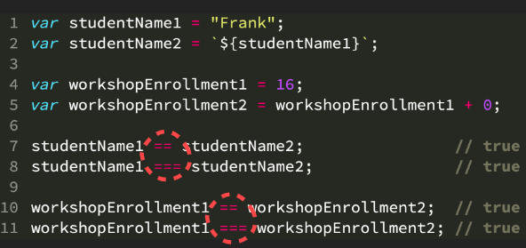
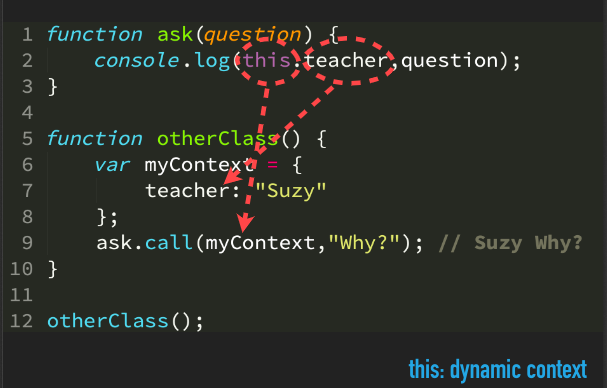
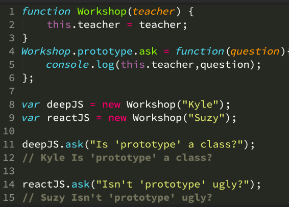

# Getting Started with JavaScript, v2

**Note**: [Course Resources](https://static.frontendmasters.com/resources/2019-05-08-getting-into-javascript/getting-into-javascript.pdf)

## Table of Contents

- [Getting Started with JavaScript, v2](#getting-started-with-javascript-v2)
  - [Table of Contents](#table-of-contents)
    - [Introduction](#introduction)
    - [Programming Primer](#programming-primer)
      - [Values](#values)
      - [Operations](#operations)
      - [Types](#types)
      - [Variables](#variables)
      - [Expressions and Statements](#expressions-and-statements)
      - [Decisions or IF ELSE](#decisions-or-if-else)
      - [Loops](#loops)
      - [Functions](#functions)
    - [Types & Coercion](#types--coercion)
      - [NaN (~~Not a Number~~)](#nan-not-a-number)
      - [New](#new)
      - [Coercion (Convert One type to Another Type)](#coercion-convert-one-type-to-another-type)
      - [Booleans](#booleans)
      - [Scoping or Block Scoping](#scoping-or-block-scoping)
    - [this and Prototypes System](#this-and-prototypes-system)
      - [Prototypes](#prototypes)
      - [Class](#class)

### Introduction

This course for the guy `who never programmed` and has `some programming experience` but in other language.

**Overview**:

- Programming Primers
  - Values
  - Operations
  - Variables
  - Expression and Statements
  - Decisions
  - Loops
  - Functions
- Three Pillar of JS
  - Type/Coercion
  - Scope/Closures
  - this/Prototypes

### Programming Primer

#### Values

```js
// Numbers
44; // integer
3.14; // decimal
// But both are numbers

// string
("Hello, friend!");

// Boolean
true;
false;

// emptiness
null;
undefined[
  // ordered collections of values or array
  // zero-index
  (1, 2, 3)
];

// object

{
  name: "nahid";
}
```

#### Operations

```js
// Math Operation
// Addition, subtraction, division, multiplication, modules, power
3 + 5; // 8
19 - 1; // 18

// string operation
"Nahid" + " " + "Hassan"; // Nahid Hassan

// unary operator
!false; // true

// Comparison operator / Relational
3.0 == 3; // true
3.9 === 3.9; // true
3 < 4; // true

// Conditional Operator / logical operator
4 || 3; // true
true || false; // true
```

#### Types

```js
typeof 43; // number
typeof "nahid"; // string
typeof true; // boolean
typeof undefined; // undefined
typeof { name: "Doe" }; // object
typeof null; // object
typeof [1, 2, 3]; // object
```

#### Variables

```js
// A variable is like a place in memory
// we can also use `var` instead of `let`
// but let is more updated than var.
let name = "Md. Nahid Hassan";
let age; // undefined

age = 23; // defined

let friends = ["Mahin", "Nahid", "Meem"];

// return the friends array length
// length is a properties, not method
console.log(friends.length);
// access the first item from the array
console.log(friends[0]);

var age1 = 23;
age1++; // increment age by 1
age1 += 2; // increment age variable by 2
console.log(age1); // 26
```

#### Expressions and Statements

```js
// declare a variable
// and this line of code is a statement
let age = 23;

// expression
// also statement
// all or total 6 expression
// 2
// age
// (age * 2)
// 1
// 1 + (age * 2)
// age = 1 + (age * 2) // full statement
age = 1 + age * 2;
```

#### Decisions or IF ELSE

```js
// making decisions

let age = 23;

// if true goVote() is call
if (age >= 18) {
  goVote();
}

// if isEnrolled true takeClass() is invoke
// else `else` portion enrollFirst is invoke.
if (isEnrolled()) {
  takeClass();
} else {
  enrolledFirst();
}
```

#### Loops

```js
let students = {
  /*....*/
};

// method -1
for (let i = 0; i < students.length; i++) {
  greetStudent(students[i]);
}

// method -2
for (let student of students) {
  greetStudent(student);
}

// while loop

while (students.length > 0) {
  let student = students.pop();
  greetStudent(student);
}
```

#### Functions

```js
// example -1
function greetStudent(student) {
  console.log(`Hello, ${student.name}`);
}

// example -2
function timeRemaining(timeElapsed, endTime) {
  return endTime - timeElapsed;
}

let left = timeRemaining(34, 232);
console.log(left); // 198
```

### Types & Coercion

> In JavaScript, everything is an object - `false`

**Primitive Types**:

- undefined
- string
- number
- boolean
- object
- symbol
- null ?
- function ?
- array ?

> In JavaScript, **variables** `don't` have types, **values** `do`.

```js
let v;
console.log(typeof v); // undefined

v = "1";
console.log(typeof v); // string

v = 2;
console.log(typeof v); // number

v = true;
console.log(typeof v); // boolean

v = {};
console.log(typeof v); // object

v = Symbol();
console.log(typeof v); // symbol

console.log(typeof huda); // undefined

v = null;
console.log(typeof v); // object

v = function () {};
console.log(typeof v); // function

v = [1, 2, 3];
console.log(typeof v); // object
```

#### NaN (~~Not a Number~~)

```js
let greeting = "Hello, class!";

let something = greeting / 2; // ?!?!?!

console.log(typeof something); // NaN
console.log(Number.isNaN(something)); // true
console.log(Number.isNaN(greeting)); //  false
```

#### New

| Use new    | Don't use new |
| ---------- | ------------- |
| Object()   | String()      |
| Array()    | Number()      |
| Function() | Boolean()     |
| Date()     |               |
| RegExp()   |               |
| Error()    |               |

```js
// Create Date Object
let yesterday = new Date("June 8, 2021");
yesterday.toUTCString();
console.log(yesterday);

// Create String Object
let myGPA = String(transcript.gpa); // "3.4"
```

#### Coercion (Convert One type to Another Type)

| Type-1 | Type-2 | Type-3 |
| ------ | ------ | ------ |
| Number | Number | Number |
| Number | String | String |
| String | Number | String |
| String | String | String |

```js
let msg1 = "There are ";
let numStudents = 20;
let msg2 = " students.";

// type -1
console.log(msg1 + numStudents + msg2);
// "There are 20 students."

// type -2
console.log(`There are ${numStudents} students.`);

// function
function addStudent(numStudents) {
  return numStudents + 1;
}

// DOM return value/number as string
// call addStudent()
// Number(string) // convert string to a number
addStudent(Number(studentsInputElem.value));
// 12
```

#### Booleans

| Falsy     | Truthy           |
| --------- | ---------------- |
| ""        | "foo"            |
| 0,-0      | 23               |
| null      | {a: 1}           |
| NaN       | [1,2]            |
| false     | true             |
| undefined | function() {...} |

```js
/**
 * if (true) {
 *  // this block of code execute
 * }
 */

if (studentInputElem.value) {
  numStudents = Number(studentsInputElem.value);
}

/**
 * while (true) {
 *  this block of code execute
 * }
 */

while (newStudents.length) {
  enrollStudent(newStudents.pop());
}

// !newStudents.length
//------ both are same---
// newStudents.length > 0

// Note:

// !false -> true
// !!false -> false
// !!!false -> true
```



#### Scoping or Block Scoping

- `var`: function scoped variable.
- `let, const (from ES6)`: block-scoped variable.

**Example - 1**:

```js
let teacher = "Nahid";

(function anotherTeacher() {
  let teacher = "Mahin";
  console.log(teacher); // Mahin
})(); // immediately invoked

console.log(teacher); // Mahin
```

**Example - 2**:

Literately same as previous....**scoping**.

```js
let teacher = "Nahid";
{
  let teacher = "Mahin";
  console.log(teacher);
}

console.log(teacher);
```

**Example - 3**:

```js
function formatStr(str) {
  // prefix and rest only exist in this
  // curly brace.
  {
    let prefix, rest;
    prefix = str.slice(0, 3);
    rest = str.slice(3);
    str = prefix.toUpperCase() + rest;
  }
  // rest of the code
}
```

### this and Prototypes System

- A function's `this` references the execution context for that call. determined entirely by `how the function was called.`

```js
// example - 2
let workshop = {
  teacher: "Nahid",
  ask(question) {
    console.log(this.teacher, question);
  },
};

/**
 * None of the line is important, it is only important line
 * workshop.ask(.....), this determined what the this keyword
 * referred.
 */

// implicit binding
workshop.ask("what is implicit binding");
// Nahid what is implicit binding.
```



```js
function ask(question) {
  let teacher = "nahid";
  // this.teacher is not nahid
  // it is mahin
  console.log(this.teacher, question);
  console.log(teacher);
  console.log(this.teacher);
}

function otherClass() {
  var myContext = {
    teacher: "mahin",
  };
  // explicit binding
  ask.call(myContext, "why"); // call from here
}

otherClass();
```

#### Prototypes



```js
function Workshop(teacher) {
  this.teacher = teacher;
  console.log(this.teacher);
}

Workshop.prototype.ask = function (question) {
  console.log(this.teacher, question);
};

let deepJS = new Workshop("Nahid");
let reactJS = new Workshop("Mahin");

deepJS.ask("Something...");
reactJS.ask("Anything...");

console.log(reactJS.teacher); // lokkhipur
console.log(deepJS.teacher); //
```

#### Class

```js
class Workshop {
  constructor(teacher) {
    this.teacher = teacher;
    console.log(this.teacher);
  }
  ask(question) {
    console.log(this.teacher, question);
  }
}

let deepJS = new Workshop("Nahid");
let reactJS = new Workshop("Mahin");

deepJS.ask("Something...");
reactJS.ask("Anything...");

console.log(reactJS.teacher); // lokkhipur
console.log(deepJS.teacher); //
```

> Prototype `system` is work like `class`
